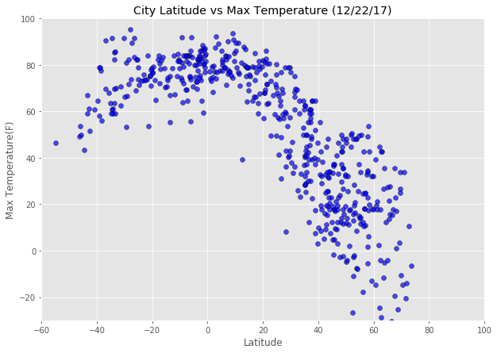
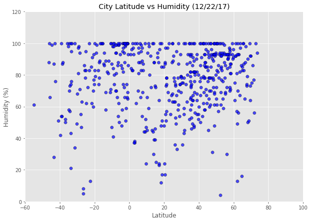
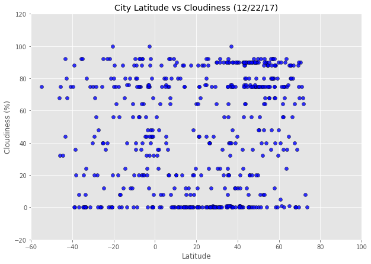
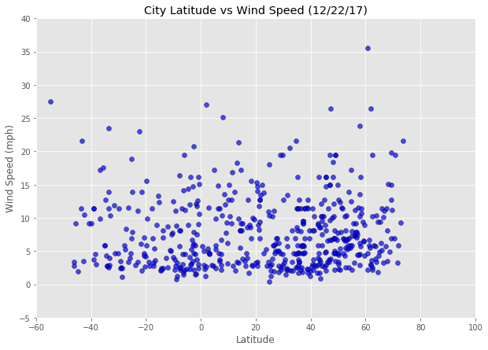

### Note:

I am using OpenWeatherMap api in my code, to get the weather data for the list of randomly generated cities. To use this code, you will need to register with OpenWeatherMap.
Once you register, you will receive an App Token. Store that App Token in the file named apiKey. 


## Analysis:
1. Cloudiness, Humidity and Wind speed of this sample of cities dont seem to have a correlation with Latitude.
2. Maximum Temperature of the cities in the sample have a good correlation with the Latitude.
3. As we move towards the North/South pole, the temperature gradually decreases. Temperature is high near the equator.


```python
# Dependencies
import pandas as pd
import json
import requests as req
import matplotlib.pyplot as plt
from random import uniform
from citipy import citipy
import time
```


```python
def get_file_contents(filename):  
    try:
        with open(filename, 'r') as f:
            #file contains a single line with API key
            return f.read().strip()
    except FileNotFoundError:
        print("'%s' file not found" % filename)
```


```python
# Save config information
api_key = get_file_contents("apiKey.txt")
units = "Imperial"
# generate the url
url = "http://api.openweathermap.org/data/2.5/weather?units=%s&APPID=%s&q=" %(units, api_key)

```


```python
# define a function that randomly generates Lat & Lng coordinates
def newLatLng():
    return uniform(-180,180), uniform(-180, 180)
cities=[]
points = (newLatLng() for x in range(10000))
for point in points:
    lat, lng = point
    city = citipy.nearest_city(lat,lng)
    cities.append(city.city_name)

```


```python
# get list of unique city names and save it to a DF
cities_list = list(set(cities))
city_df = pd.DataFrame(cities_list)
# Slect a sample of 500 cities
sample_city_df = city_df.sample(600)

sample_city_df = sample_city_df.rename(columns={0: "City"})
sample_city_df.reset_index(inplace=True)
sample_city_df = sample_city_df.drop(["index"], axis=1)

```


```python
# create empty columns for all the data that you need from weatherapi call
sample_city_df["Cloudiness"] = ""
sample_city_df["Country"] = ""
sample_city_df["Date"] = ""
sample_city_df["Humidity"] = ""
sample_city_df["Lat"] = ""
sample_city_df["Lng"] = ""
sample_city_df["Max Temp"] = ""
sample_city_df["Wind Speed"] = ""

print("Beginning Data Retrieval")
print("-----------------------------")
# iterate over rows and save the data from weatherapi response to a dataframe
for index, row in sample_city_df.iterrows():
    # Error handling
    try:
        city_name = row["City"]
        target_url = url+ city_name
        weather_response = req.get(target_url).json()
        row["Cloudiness"] = weather_response["clouds"]["all"]
        row["Country"] = weather_response["sys"]["country"]
        row["Date"] = weather_response["dt"]
        row["Humidity"] = weather_response["main"]["humidity"]
        row["Lat"] = weather_response["coord"]["lat"]
        row["Lng"] = weather_response["coord"]["lon"]
        row["Max Temp"] = weather_response["main"]["temp_max"]
        row["Wind Speed"] = weather_response["wind"]["speed"]
    
        print("Processing Record %d  | %s" %(index, city_name))
        print(target_url)
    
    # If an error is encountered, move on with the next iteration of the loop
    except:
        continue  
```

    Beginning Data Retrieval
    -----------------------------
    Processing Record 0  | sobradinho
    http://api.openweathermap.org/data/2.5/weather?units=Imperial&APPID=62605fb3e89660f7efc80a3e344e83cf&q=sobradinho
    Processing Record 1  | alekseyevsk
    http://api.openweathermap.org/data/2.5/weather?units=Imperial&APPID=62605fb3e89660f7efc80a3e344e83cf&q=alekseyevsk
    Processing Record 2  | lompoc
    http://api.openweathermap.org/data/2.5/weather?units=Imperial&APPID=62605fb3e89660f7efc80a3e344e83cf&q=lompoc
    Processing Record 3  | pallasovka
    http://api.openweathermap.org/data/2.5/weather?units=Imperial&APPID=62605fb3e89660f7efc80a3e344e83cf&q=pallasovka
    Processing Record 4  | devils lake
    http://api.openweathermap.org/data/2.5/weather?units=Imperial&APPID=62605fb3e89660f7efc80a3e344e83cf&q=devils lake
    Processing Record 5  | lovozero
    http://api.openweathermap.org/data/2.5/weather?units=Imperial&APPID=62605fb3e89660f7efc80a3e344e83cf&q=lovozero
    Processing Record 6  | mayumba
    http://api.openweathermap.org/data/2.5/weather?units=Imperial&APPID=62605fb3e89660f7efc80a3e344e83cf&q=mayumba
    Processing Record 8  | atar
    http://api.openweathermap.org/data/2.5/weather?units=Imperial&APPID=62605fb3e89660f7efc80a3e344e83cf&q=atar
    Processing Record 9  | yangjiang
    http://api.openweathermap.org/data/2.5/weather?units=Imperial&APPID=62605fb3e89660f7efc80a3e344e83cf&q=yangjiang
    Processing Record 10  | antigonish
    http://api.openweathermap.org/data/2.5/weather?units=Imperial&APPID=62605fb3e89660f7efc80a3e344e83cf&q=antigonish
    Processing Record 11  | kendrapara
    http://api.openweathermap.org/data/2.5/weather?units=Imperial&APPID=62605fb3e89660f7efc80a3e344e83cf&q=kendrapara
    Processing Record 12  | dongsheng
    http://api.openweathermap.org/data/2.5/weather?units=Imperial&APPID=62605fb3e89660f7efc80a3e344e83cf&q=dongsheng
    Processing Record 13  | cherskiy
    http://api.openweathermap.org/data/2.5/weather?units=Imperial&APPID=62605fb3e89660f7efc80a3e344e83cf&q=cherskiy
    Processing Record 14  | tabou
    http://api.openweathermap.org/data/2.5/weather?units=Imperial&APPID=62605fb3e89660f7efc80a3e344e83cf&q=tabou
    Processing Record 15  | hirara
    http://api.openweathermap.org/data/2.5/weather?units=Imperial&APPID=62605fb3e89660f7efc80a3e344e83cf&q=hirara
    Processing Record 16  | zaraza
    http://api.openweathermap.org/data/2.5/weather?units=Imperial&APPID=62605fb3e89660f7efc80a3e344e83cf&q=zaraza
    Processing Record 17  | dikson
    http://api.openweathermap.org/data/2.5/weather?units=Imperial&APPID=62605fb3e89660f7efc80a3e344e83cf&q=dikson
    Processing Record 18  | sorong
    http://api.openweathermap.org/data/2.5/weather?units=Imperial&APPID=62605fb3e89660f7efc80a3e344e83cf&q=sorong
    Processing Record 20  | kurduvadi
    http://api.openweathermap.org/data/2.5/weather?units=Imperial&APPID=62605fb3e89660f7efc80a3e344e83cf&q=kurduvadi
    Processing Record 21  | mildura
    http://api.openweathermap.org/data/2.5/weather?units=Imperial&APPID=62605fb3e89660f7efc80a3e344e83cf&q=mildura
    Processing Record 22  | alexandria
    http://api.openweathermap.org/data/2.5/weather?units=Imperial&APPID=62605fb3e89660f7efc80a3e344e83cf&q=alexandria
    Processing Record 23  | ngunguru
    http://api.openweathermap.org/data/2.5/weather?units=Imperial&APPID=62605fb3e89660f7efc80a3e344e83cf&q=ngunguru
    Processing Record 24  | orange
    http://api.openweathermap.org/data/2.5/weather?units=Imperial&APPID=62605fb3e89660f7efc80a3e344e83cf&q=orange
    Processing Record 26  | mirabad
    http://api.openweathermap.org/data/2.5/weather?units=Imperial&APPID=62605fb3e89660f7efc80a3e344e83cf&q=mirabad
    Processing Record 28  | bud
    http://api.openweathermap.org/data/2.5/weather?units=Imperial&APPID=62605fb3e89660f7efc80a3e344e83cf&q=bud
    Processing Record 29  | atikokan
    http://api.openweathermap.org/data/2.5/weather?units=Imperial&APPID=62605fb3e89660f7efc80a3e344e83cf&q=atikokan
    Processing Record 30  | albanel
    http://api.openweathermap.org/data/2.5/weather?units=Imperial&APPID=62605fb3e89660f7efc80a3e344e83cf&q=albanel
    Processing Record 31  | waynesville
    http://api.openweathermap.org/data/2.5/weather?units=Imperial&APPID=62605fb3e89660f7efc80a3e344e83cf&q=waynesville
    Processing Record 32  | mayo
    http://api.openweathermap.org/data/2.5/weather?units=Imperial&APPID=62605fb3e89660f7efc80a3e344e83cf&q=mayo
    Processing Record 34  | ierapetra
    http://api.openweathermap.org/data/2.5/weather?units=Imperial&APPID=62605fb3e89660f7efc80a3e344e83cf&q=ierapetra
    Processing Record 35  | kawalu
    http://api.openweathermap.org/data/2.5/weather?units=Imperial&APPID=62605fb3e89660f7efc80a3e344e83cf&q=kawalu
    Processing Record 36  | qinhuangdao
    http://api.openweathermap.org/data/2.5/weather?units=Imperial&APPID=62605fb3e89660f7efc80a3e344e83cf&q=qinhuangdao
    Processing Record 37  | tomatlan
    http://api.openweathermap.org/data/2.5/weather?units=Imperial&APPID=62605fb3e89660f7efc80a3e344e83cf&q=tomatlan
    Processing Record 38  | matagami
    http://api.openweathermap.org/data/2.5/weather?units=Imperial&APPID=62605fb3e89660f7efc80a3e344e83cf&q=matagami
    Processing Record 39  | kantang
    http://api.openweathermap.org/data/2.5/weather?units=Imperial&APPID=62605fb3e89660f7efc80a3e344e83cf&q=kantang
    Processing Record 40  | lerdo
    http://api.openweathermap.org/data/2.5/weather?units=Imperial&APPID=62605fb3e89660f7efc80a3e344e83cf&q=lerdo
    Processing Record 41  | ramhormoz
    http://api.openweathermap.org/data/2.5/weather?units=Imperial&APPID=62605fb3e89660f7efc80a3e344e83cf&q=ramhormoz
    Processing Record 42  | tiksi
    http://api.openweathermap.org/data/2.5/weather?units=Imperial&APPID=62605fb3e89660f7efc80a3e344e83cf&q=tiksi
    Processing Record 43  | cururupu
    http://api.openweathermap.org/data/2.5/weather?units=Imperial&APPID=62605fb3e89660f7efc80a3e344e83cf&q=cururupu
    Processing Record 44  | vilhena
    http://api.openweathermap.org/data/2.5/weather?units=Imperial&APPID=62605fb3e89660f7efc80a3e344e83cf&q=vilhena
    Processing Record 45  | ayolas
    http://api.openweathermap.org/data/2.5/weather?units=Imperial&APPID=62605fb3e89660f7efc80a3e344e83cf&q=ayolas
    Processing Record 46  | imeni poliny osipenko
    http://api.openweathermap.org/data/2.5/weather?units=Imperial&APPID=62605fb3e89660f7efc80a3e344e83cf&q=imeni poliny osipenko
    Processing Record 47  | sao pedro do piaui
    http://api.openweathermap.org/data/2.5/weather?units=Imperial&APPID=62605fb3e89660f7efc80a3e344e83cf&q=sao pedro do piaui
    Processing Record 48  | salinopolis
    http://api.openweathermap.org/data/2.5/weather?units=Imperial&APPID=62605fb3e89660f7efc80a3e344e83cf&q=salinopolis
    Processing Record 49  | kirakira
    http://api.openweathermap.org/data/2.5/weather?units=Imperial&APPID=62605fb3e89660f7efc80a3e344e83cf&q=kirakira
    Processing Record 50  | tuatapere
    http://api.openweathermap.org/data/2.5/weather?units=Imperial&APPID=62605fb3e89660f7efc80a3e344e83cf&q=tuatapere
    Processing Record 52  | torzhok
    http://api.openweathermap.org/data/2.5/weather?units=Imperial&APPID=62605fb3e89660f7efc80a3e344e83cf&q=torzhok
    Processing Record 53  | ca mau
    http://api.openweathermap.org/data/2.5/weather?units=Imperial&APPID=62605fb3e89660f7efc80a3e344e83cf&q=ca mau
    Processing Record 54  | augusto correa
    http://api.openweathermap.org/data/2.5/weather?units=Imperial&APPID=62605fb3e89660f7efc80a3e344e83cf&q=augusto correa
    Processing Record 55  | iqaluit
    http://api.openweathermap.org/data/2.5/weather?units=Imperial&APPID=62605fb3e89660f7efc80a3e344e83cf&q=iqaluit
    Processing Record 56  | eyl
    http://api.openweathermap.org/data/2.5/weather?units=Imperial&APPID=62605fb3e89660f7efc80a3e344e83cf&q=eyl
    Processing Record 57  | weilheim
    http://api.openweathermap.org/data/2.5/weather?units=Imperial&APPID=62605fb3e89660f7efc80a3e344e83cf&q=weilheim
    Processing Record 59  | tutoia
    http://api.openweathermap.org/data/2.5/weather?units=Imperial&APPID=62605fb3e89660f7efc80a3e344e83cf&q=tutoia
    Processing Record 60  | rumonge
    http://api.openweathermap.org/data/2.5/weather?units=Imperial&APPID=62605fb3e89660f7efc80a3e344e83cf&q=rumonge
    Processing Record 61  | pevek
    http://api.openweathermap.org/data/2.5/weather?units=Imperial&APPID=62605fb3e89660f7efc80a3e344e83cf&q=pevek
    Processing Record 62  | goderich
    http://api.openweathermap.org/data/2.5/weather?units=Imperial&APPID=62605fb3e89660f7efc80a3e344e83cf&q=goderich
    Processing Record 63  | rawson
    http://api.openweathermap.org/data/2.5/weather?units=Imperial&APPID=62605fb3e89660f7efc80a3e344e83cf&q=rawson
    Processing Record 64  | poco das trincheiras
    http://api.openweathermap.org/data/2.5/weather?units=Imperial&APPID=62605fb3e89660f7efc80a3e344e83cf&q=poco das trincheiras
    Processing Record 65  | great yarmouth
    http://api.openweathermap.org/data/2.5/weather?units=Imperial&APPID=62605fb3e89660f7efc80a3e344e83cf&q=great yarmouth
    Processing Record 66  | biak
    http://api.openweathermap.org/data/2.5/weather?units=Imperial&APPID=62605fb3e89660f7efc80a3e344e83cf&q=biak
    Processing Record 67  | mayor pablo lagerenza
    http://api.openweathermap.org/data/2.5/weather?units=Imperial&APPID=62605fb3e89660f7efc80a3e344e83cf&q=mayor pablo lagerenza
    Processing Record 68  | itoman
    http://api.openweathermap.org/data/2.5/weather?units=Imperial&APPID=62605fb3e89660f7efc80a3e344e83cf&q=itoman
    Processing Record 69  | kahului
    http://api.openweathermap.org/data/2.5/weather?units=Imperial&APPID=62605fb3e89660f7efc80a3e344e83cf&q=kahului
    Processing Record 70  | flinders
    http://api.openweathermap.org/data/2.5/weather?units=Imperial&APPID=62605fb3e89660f7efc80a3e344e83cf&q=flinders
    Processing Record 71  | zaliztsi
    http://api.openweathermap.org/data/2.5/weather?units=Imperial&APPID=62605fb3e89660f7efc80a3e344e83cf&q=zaliztsi
    Processing Record 72  | pangody
    http://api.openweathermap.org/data/2.5/weather?units=Imperial&APPID=62605fb3e89660f7efc80a3e344e83cf&q=pangody
    Processing Record 73  | kizilskoye
    http://api.openweathermap.org/data/2.5/weather?units=Imperial&APPID=62605fb3e89660f7efc80a3e344e83cf&q=kizilskoye
    Processing Record 74  | aripuana
    http://api.openweathermap.org/data/2.5/weather?units=Imperial&APPID=62605fb3e89660f7efc80a3e344e83cf&q=aripuana
    Processing Record 75  | georgetown
    http://api.openweathermap.org/data/2.5/weather?units=Imperial&APPID=62605fb3e89660f7efc80a3e344e83cf&q=georgetown
    Processing Record 76  | nizwa
    http://api.openweathermap.org/data/2.5/weather?units=Imperial&APPID=62605fb3e89660f7efc80a3e344e83cf&q=nizwa
    Processing Record 77  | maragheh
    http://api.openweathermap.org/data/2.5/weather?units=Imperial&APPID=62605fb3e89660f7efc80a3e344e83cf&q=maragheh
    Processing Record 78  | saronno
    http://api.openweathermap.org/data/2.5/weather?units=Imperial&APPID=62605fb3e89660f7efc80a3e344e83cf&q=saronno
    Processing Record 79  | hambantota
    http://api.openweathermap.org/data/2.5/weather?units=Imperial&APPID=62605fb3e89660f7efc80a3e344e83cf&q=hambantota
    Processing Record 81  | zhanaozen
    http://api.openweathermap.org/data/2.5/weather?units=Imperial&APPID=62605fb3e89660f7efc80a3e344e83cf&q=zhanaozen
    Processing Record 82  | kalmunai
    http://api.openweathermap.org/data/2.5/weather?units=Imperial&APPID=62605fb3e89660f7efc80a3e344e83cf&q=kalmunai
    Processing Record 83  | albufeira
    http://api.openweathermap.org/data/2.5/weather?units=Imperial&APPID=62605fb3e89660f7efc80a3e344e83cf&q=albufeira
    Processing Record 84  | necochea
    http://api.openweathermap.org/data/2.5/weather?units=Imperial&APPID=62605fb3e89660f7efc80a3e344e83cf&q=necochea
    Processing Record 85  | elbrus
    http://api.openweathermap.org/data/2.5/weather?units=Imperial&APPID=62605fb3e89660f7efc80a3e344e83cf&q=elbrus
    Processing Record 86  | mangai
    http://api.openweathermap.org/data/2.5/weather?units=Imperial&APPID=62605fb3e89660f7efc80a3e344e83cf&q=mangai
    Processing Record 87  | westport
    http://api.openweathermap.org/data/2.5/weather?units=Imperial&APPID=62605fb3e89660f7efc80a3e344e83cf&q=westport
    Processing Record 88  | barsovo
    http://api.openweathermap.org/data/2.5/weather?units=Imperial&APPID=62605fb3e89660f7efc80a3e344e83cf&q=barsovo
    Processing Record 91  | taybad
    http://api.openweathermap.org/data/2.5/weather?units=Imperial&APPID=62605fb3e89660f7efc80a3e344e83cf&q=taybad
    Processing Record 92  | christchurch
    http://api.openweathermap.org/data/2.5/weather?units=Imperial&APPID=62605fb3e89660f7efc80a3e344e83cf&q=christchurch
    Processing Record 93  | muana
    http://api.openweathermap.org/data/2.5/weather?units=Imperial&APPID=62605fb3e89660f7efc80a3e344e83cf&q=muana
    Processing Record 94  | sol-iletsk
    http://api.openweathermap.org/data/2.5/weather?units=Imperial&APPID=62605fb3e89660f7efc80a3e344e83cf&q=sol-iletsk
    Processing Record 95  | bam
    http://api.openweathermap.org/data/2.5/weather?units=Imperial&APPID=62605fb3e89660f7efc80a3e344e83cf&q=bam
    Processing Record 96  | tsiroanomandidy
    http://api.openweathermap.org/data/2.5/weather?units=Imperial&APPID=62605fb3e89660f7efc80a3e344e83cf&q=tsiroanomandidy
    Processing Record 97  | chipinge
    http://api.openweathermap.org/data/2.5/weather?units=Imperial&APPID=62605fb3e89660f7efc80a3e344e83cf&q=chipinge
    Processing Record 98  | kukushtan
    http://api.openweathermap.org/data/2.5/weather?units=Imperial&APPID=62605fb3e89660f7efc80a3e344e83cf&q=kukushtan
    Processing Record 99  | namibe
    http://api.openweathermap.org/data/2.5/weather?units=Imperial&APPID=62605fb3e89660f7efc80a3e344e83cf&q=namibe
    Processing Record 101  | omboue
    http://api.openweathermap.org/data/2.5/weather?units=Imperial&APPID=62605fb3e89660f7efc80a3e344e83cf&q=omboue
    Processing Record 102  | sibolga
    http://api.openweathermap.org/data/2.5/weather?units=Imperial&APPID=62605fb3e89660f7efc80a3e344e83cf&q=sibolga
    Processing Record 103  | tura
    http://api.openweathermap.org/data/2.5/weather?units=Imperial&APPID=62605fb3e89660f7efc80a3e344e83cf&q=tura
    Processing Record 104  | calvinia
    http://api.openweathermap.org/data/2.5/weather?units=Imperial&APPID=62605fb3e89660f7efc80a3e344e83cf&q=calvinia
    Processing Record 106  | east liverpool
    http://api.openweathermap.org/data/2.5/weather?units=Imperial&APPID=62605fb3e89660f7efc80a3e344e83cf&q=east liverpool
    Processing Record 107  | anchorage
    http://api.openweathermap.org/data/2.5/weather?units=Imperial&APPID=62605fb3e89660f7efc80a3e344e83cf&q=anchorage
    Processing Record 108  | ramnagar
    http://api.openweathermap.org/data/2.5/weather?units=Imperial&APPID=62605fb3e89660f7efc80a3e344e83cf&q=ramnagar
    Processing Record 109  | praia da vitoria
    http://api.openweathermap.org/data/2.5/weather?units=Imperial&APPID=62605fb3e89660f7efc80a3e344e83cf&q=praia da vitoria
    Processing Record 110  | ambovombe
    http://api.openweathermap.org/data/2.5/weather?units=Imperial&APPID=62605fb3e89660f7efc80a3e344e83cf&q=ambovombe
    Processing Record 111  | andapa
    http://api.openweathermap.org/data/2.5/weather?units=Imperial&APPID=62605fb3e89660f7efc80a3e344e83cf&q=andapa
    Processing Record 112  | djougou
    http://api.openweathermap.org/data/2.5/weather?units=Imperial&APPID=62605fb3e89660f7efc80a3e344e83cf&q=djougou
    Processing Record 113  | amahai
    http://api.openweathermap.org/data/2.5/weather?units=Imperial&APPID=62605fb3e89660f7efc80a3e344e83cf&q=amahai
    Processing Record 114  | loandjili
    http://api.openweathermap.org/data/2.5/weather?units=Imperial&APPID=62605fb3e89660f7efc80a3e344e83cf&q=loandjili
    Processing Record 117  | albany
    http://api.openweathermap.org/data/2.5/weather?units=Imperial&APPID=62605fb3e89660f7efc80a3e344e83cf&q=albany
    Processing Record 118  | timizart
    http://api.openweathermap.org/data/2.5/weather?units=Imperial&APPID=62605fb3e89660f7efc80a3e344e83cf&q=timizart
    Processing Record 119  | rudnichnyy
    http://api.openweathermap.org/data/2.5/weather?units=Imperial&APPID=62605fb3e89660f7efc80a3e344e83cf&q=rudnichnyy
    Processing Record 120  | angoche
    http://api.openweathermap.org/data/2.5/weather?units=Imperial&APPID=62605fb3e89660f7efc80a3e344e83cf&q=angoche
    Processing Record 121  | fallon
    http://api.openweathermap.org/data/2.5/weather?units=Imperial&APPID=62605fb3e89660f7efc80a3e344e83cf&q=fallon
    Processing Record 122  | zhaoyuan
    http://api.openweathermap.org/data/2.5/weather?units=Imperial&APPID=62605fb3e89660f7efc80a3e344e83cf&q=zhaoyuan
    Processing Record 123  | kushima
    http://api.openweathermap.org/data/2.5/weather?units=Imperial&APPID=62605fb3e89660f7efc80a3e344e83cf&q=kushima
    Processing Record 124  | vila velha
    http://api.openweathermap.org/data/2.5/weather?units=Imperial&APPID=62605fb3e89660f7efc80a3e344e83cf&q=vila velha
    Processing Record 125  | roald
    http://api.openweathermap.org/data/2.5/weather?units=Imperial&APPID=62605fb3e89660f7efc80a3e344e83cf&q=roald
    Processing Record 126  | clyde river
    http://api.openweathermap.org/data/2.5/weather?units=Imperial&APPID=62605fb3e89660f7efc80a3e344e83cf&q=clyde river
    Processing Record 127  | strelka
    http://api.openweathermap.org/data/2.5/weather?units=Imperial&APPID=62605fb3e89660f7efc80a3e344e83cf&q=strelka
    Processing Record 128  | tangwani
    http://api.openweathermap.org/data/2.5/weather?units=Imperial&APPID=62605fb3e89660f7efc80a3e344e83cf&q=tangwani
    Processing Record 129  | hasaki
    http://api.openweathermap.org/data/2.5/weather?units=Imperial&APPID=62605fb3e89660f7efc80a3e344e83cf&q=hasaki
    Processing Record 130  | mersing
    http://api.openweathermap.org/data/2.5/weather?units=Imperial&APPID=62605fb3e89660f7efc80a3e344e83cf&q=mersing
    Processing Record 132  | la ronge
    http://api.openweathermap.org/data/2.5/weather?units=Imperial&APPID=62605fb3e89660f7efc80a3e344e83cf&q=la ronge
    Processing Record 133  | kasongo-lunda
    http://api.openweathermap.org/data/2.5/weather?units=Imperial&APPID=62605fb3e89660f7efc80a3e344e83cf&q=kasongo-lunda
    Processing Record 134  | cabo san lucas
    http://api.openweathermap.org/data/2.5/weather?units=Imperial&APPID=62605fb3e89660f7efc80a3e344e83cf&q=cabo san lucas
    Processing Record 135  | karasjok
    http://api.openweathermap.org/data/2.5/weather?units=Imperial&APPID=62605fb3e89660f7efc80a3e344e83cf&q=karasjok
    Processing Record 136  | waounde
    http://api.openweathermap.org/data/2.5/weather?units=Imperial&APPID=62605fb3e89660f7efc80a3e344e83cf&q=waounde
    Processing Record 137  | purranque
    http://api.openweathermap.org/data/2.5/weather?units=Imperial&APPID=62605fb3e89660f7efc80a3e344e83cf&q=purranque
    Processing Record 138  | palma di montechiaro
    http://api.openweathermap.org/data/2.5/weather?units=Imperial&APPID=62605fb3e89660f7efc80a3e344e83cf&q=palma di montechiaro
    Processing Record 139  | poso
    http://api.openweathermap.org/data/2.5/weather?units=Imperial&APPID=62605fb3e89660f7efc80a3e344e83cf&q=poso
    Processing Record 140  | micco
    http://api.openweathermap.org/data/2.5/weather?units=Imperial&APPID=62605fb3e89660f7efc80a3e344e83cf&q=micco
    Processing Record 141  | agadez
    http://api.openweathermap.org/data/2.5/weather?units=Imperial&APPID=62605fb3e89660f7efc80a3e344e83cf&q=agadez
    Processing Record 142  | naberera
    http://api.openweathermap.org/data/2.5/weather?units=Imperial&APPID=62605fb3e89660f7efc80a3e344e83cf&q=naberera
    Processing Record 143  | pringsewu
    http://api.openweathermap.org/data/2.5/weather?units=Imperial&APPID=62605fb3e89660f7efc80a3e344e83cf&q=pringsewu
    Processing Record 144  | pangkalanbuun
    http://api.openweathermap.org/data/2.5/weather?units=Imperial&APPID=62605fb3e89660f7efc80a3e344e83cf&q=pangkalanbuun
    Processing Record 145  | nisia floresta
    http://api.openweathermap.org/data/2.5/weather?units=Imperial&APPID=62605fb3e89660f7efc80a3e344e83cf&q=nisia floresta
    Processing Record 146  | tolu
    http://api.openweathermap.org/data/2.5/weather?units=Imperial&APPID=62605fb3e89660f7efc80a3e344e83cf&q=tolu
    Processing Record 147  | kaiyuan
    http://api.openweathermap.org/data/2.5/weather?units=Imperial&APPID=62605fb3e89660f7efc80a3e344e83cf&q=kaiyuan
    Processing Record 148  | essenbach
    http://api.openweathermap.org/data/2.5/weather?units=Imperial&APPID=62605fb3e89660f7efc80a3e344e83cf&q=essenbach
    Processing Record 149  | isla mujeres
    http://api.openweathermap.org/data/2.5/weather?units=Imperial&APPID=62605fb3e89660f7efc80a3e344e83cf&q=isla mujeres
    Processing Record 150  | gotsu
    http://api.openweathermap.org/data/2.5/weather?units=Imperial&APPID=62605fb3e89660f7efc80a3e344e83cf&q=gotsu
    Processing Record 152  | sao joao da barra
    http://api.openweathermap.org/data/2.5/weather?units=Imperial&APPID=62605fb3e89660f7efc80a3e344e83cf&q=sao joao da barra
    Processing Record 153  | teberda
    http://api.openweathermap.org/data/2.5/weather?units=Imperial&APPID=62605fb3e89660f7efc80a3e344e83cf&q=teberda
    Processing Record 154  | kijang
    http://api.openweathermap.org/data/2.5/weather?units=Imperial&APPID=62605fb3e89660f7efc80a3e344e83cf&q=kijang
    Processing Record 156  | ammon
    http://api.openweathermap.org/data/2.5/weather?units=Imperial&APPID=62605fb3e89660f7efc80a3e344e83cf&q=ammon
    Processing Record 157  | tadpatri
    http://api.openweathermap.org/data/2.5/weather?units=Imperial&APPID=62605fb3e89660f7efc80a3e344e83cf&q=tadpatri
    Processing Record 158  | omsukchan
    http://api.openweathermap.org/data/2.5/weather?units=Imperial&APPID=62605fb3e89660f7efc80a3e344e83cf&q=omsukchan
    Processing Record 159  | tigil
    http://api.openweathermap.org/data/2.5/weather?units=Imperial&APPID=62605fb3e89660f7efc80a3e344e83cf&q=tigil
    Processing Record 161  | kumylzhenskaya
    http://api.openweathermap.org/data/2.5/weather?units=Imperial&APPID=62605fb3e89660f7efc80a3e344e83cf&q=kumylzhenskaya
    Processing Record 163  | nizhniy odes
    http://api.openweathermap.org/data/2.5/weather?units=Imperial&APPID=62605fb3e89660f7efc80a3e344e83cf&q=nizhniy odes
    Processing Record 164  | ayia galini
    http://api.openweathermap.org/data/2.5/weather?units=Imperial&APPID=62605fb3e89660f7efc80a3e344e83cf&q=ayia galini
    Processing Record 165  | semnan
    http://api.openweathermap.org/data/2.5/weather?units=Imperial&APPID=62605fb3e89660f7efc80a3e344e83cf&q=semnan
    Processing Record 166  | baykit
    http://api.openweathermap.org/data/2.5/weather?units=Imperial&APPID=62605fb3e89660f7efc80a3e344e83cf&q=baykit
    Processing Record 167  | halifax
    http://api.openweathermap.org/data/2.5/weather?units=Imperial&APPID=62605fb3e89660f7efc80a3e344e83cf&q=halifax
    Processing Record 168  | lodwar
    http://api.openweathermap.org/data/2.5/weather?units=Imperial&APPID=62605fb3e89660f7efc80a3e344e83cf&q=lodwar
    Processing Record 169  | heihe
    http://api.openweathermap.org/data/2.5/weather?units=Imperial&APPID=62605fb3e89660f7efc80a3e344e83cf&q=heihe
    Processing Record 170  | samarai
    http://api.openweathermap.org/data/2.5/weather?units=Imperial&APPID=62605fb3e89660f7efc80a3e344e83cf&q=samarai
    Processing Record 171  | bakchar
    http://api.openweathermap.org/data/2.5/weather?units=Imperial&APPID=62605fb3e89660f7efc80a3e344e83cf&q=bakchar
    Processing Record 173  | traralgon
    http://api.openweathermap.org/data/2.5/weather?units=Imperial&APPID=62605fb3e89660f7efc80a3e344e83cf&q=traralgon
    Processing Record 174  | avera
    http://api.openweathermap.org/data/2.5/weather?units=Imperial&APPID=62605fb3e89660f7efc80a3e344e83cf&q=avera
    Processing Record 176  | xining
    http://api.openweathermap.org/data/2.5/weather?units=Imperial&APPID=62605fb3e89660f7efc80a3e344e83cf&q=xining
    Processing Record 177  | tiznit
    http://api.openweathermap.org/data/2.5/weather?units=Imperial&APPID=62605fb3e89660f7efc80a3e344e83cf&q=tiznit
    Processing Record 178  | bosaso
    http://api.openweathermap.org/data/2.5/weather?units=Imperial&APPID=62605fb3e89660f7efc80a3e344e83cf&q=bosaso
    Processing Record 179  | autazes
    http://api.openweathermap.org/data/2.5/weather?units=Imperial&APPID=62605fb3e89660f7efc80a3e344e83cf&q=autazes
    Processing Record 181  | wanning
    http://api.openweathermap.org/data/2.5/weather?units=Imperial&APPID=62605fb3e89660f7efc80a3e344e83cf&q=wanning
    Processing Record 182  | marystown
    http://api.openweathermap.org/data/2.5/weather?units=Imperial&APPID=62605fb3e89660f7efc80a3e344e83cf&q=marystown
    Processing Record 183  | lorengau
    http://api.openweathermap.org/data/2.5/weather?units=Imperial&APPID=62605fb3e89660f7efc80a3e344e83cf&q=lorengau
    Processing Record 184  | pittsfield
    http://api.openweathermap.org/data/2.5/weather?units=Imperial&APPID=62605fb3e89660f7efc80a3e344e83cf&q=pittsfield
    Processing Record 185  | kiruna
    http://api.openweathermap.org/data/2.5/weather?units=Imperial&APPID=62605fb3e89660f7efc80a3e344e83cf&q=kiruna
    Processing Record 186  | kozhevnikovo
    http://api.openweathermap.org/data/2.5/weather?units=Imperial&APPID=62605fb3e89660f7efc80a3e344e83cf&q=kozhevnikovo
    Processing Record 187  | ferme-neuve
    http://api.openweathermap.org/data/2.5/weather?units=Imperial&APPID=62605fb3e89660f7efc80a3e344e83cf&q=ferme-neuve
    Processing Record 188  | leshukonskoye
    http://api.openweathermap.org/data/2.5/weather?units=Imperial&APPID=62605fb3e89660f7efc80a3e344e83cf&q=leshukonskoye
    Processing Record 189  | ullapool
    http://api.openweathermap.org/data/2.5/weather?units=Imperial&APPID=62605fb3e89660f7efc80a3e344e83cf&q=ullapool
    Processing Record 190  | ushuaia
    http://api.openweathermap.org/data/2.5/weather?units=Imperial&APPID=62605fb3e89660f7efc80a3e344e83cf&q=ushuaia
    Processing Record 191  | bongandanga
    http://api.openweathermap.org/data/2.5/weather?units=Imperial&APPID=62605fb3e89660f7efc80a3e344e83cf&q=bongandanga
    Processing Record 192  | jiuquan
    http://api.openweathermap.org/data/2.5/weather?units=Imperial&APPID=62605fb3e89660f7efc80a3e344e83cf&q=jiuquan
    Processing Record 193  | baijiantan
    http://api.openweathermap.org/data/2.5/weather?units=Imperial&APPID=62605fb3e89660f7efc80a3e344e83cf&q=baijiantan
    Processing Record 194  | kormilovka
    http://api.openweathermap.org/data/2.5/weather?units=Imperial&APPID=62605fb3e89660f7efc80a3e344e83cf&q=kormilovka
    Processing Record 195  | camacupa
    http://api.openweathermap.org/data/2.5/weather?units=Imperial&APPID=62605fb3e89660f7efc80a3e344e83cf&q=camacupa
    Processing Record 196  | mutoko
    http://api.openweathermap.org/data/2.5/weather?units=Imperial&APPID=62605fb3e89660f7efc80a3e344e83cf&q=mutoko
    Processing Record 197  | neuquen
    http://api.openweathermap.org/data/2.5/weather?units=Imperial&APPID=62605fb3e89660f7efc80a3e344e83cf&q=neuquen
    Processing Record 198  | helmsdale
    http://api.openweathermap.org/data/2.5/weather?units=Imperial&APPID=62605fb3e89660f7efc80a3e344e83cf&q=helmsdale
    Processing Record 199  | codrington
    http://api.openweathermap.org/data/2.5/weather?units=Imperial&APPID=62605fb3e89660f7efc80a3e344e83cf&q=codrington
    Processing Record 200  | olenino
    http://api.openweathermap.org/data/2.5/weather?units=Imperial&APPID=62605fb3e89660f7efc80a3e344e83cf&q=olenino
    Processing Record 201  | hare bay
    http://api.openweathermap.org/data/2.5/weather?units=Imperial&APPID=62605fb3e89660f7efc80a3e344e83cf&q=hare bay
    Processing Record 202  | andros town
    http://api.openweathermap.org/data/2.5/weather?units=Imperial&APPID=62605fb3e89660f7efc80a3e344e83cf&q=andros town
    Processing Record 203  | talcahuano
    http://api.openweathermap.org/data/2.5/weather?units=Imperial&APPID=62605fb3e89660f7efc80a3e344e83cf&q=talcahuano
    Processing Record 204  | srednekolymsk
    http://api.openweathermap.org/data/2.5/weather?units=Imperial&APPID=62605fb3e89660f7efc80a3e344e83cf&q=srednekolymsk
    Processing Record 205  | ahvaz
    http://api.openweathermap.org/data/2.5/weather?units=Imperial&APPID=62605fb3e89660f7efc80a3e344e83cf&q=ahvaz
    Processing Record 206  | tuktoyaktuk
    http://api.openweathermap.org/data/2.5/weather?units=Imperial&APPID=62605fb3e89660f7efc80a3e344e83cf&q=tuktoyaktuk
    Processing Record 207  | taywarah
    http://api.openweathermap.org/data/2.5/weather?units=Imperial&APPID=62605fb3e89660f7efc80a3e344e83cf&q=taywarah
    Processing Record 208  | cabedelo
    http://api.openweathermap.org/data/2.5/weather?units=Imperial&APPID=62605fb3e89660f7efc80a3e344e83cf&q=cabedelo
    Processing Record 209  | the pas
    http://api.openweathermap.org/data/2.5/weather?units=Imperial&APPID=62605fb3e89660f7efc80a3e344e83cf&q=the pas
    Processing Record 210  | paarl
    http://api.openweathermap.org/data/2.5/weather?units=Imperial&APPID=62605fb3e89660f7efc80a3e344e83cf&q=paarl
    Processing Record 211  | asyut
    http://api.openweathermap.org/data/2.5/weather?units=Imperial&APPID=62605fb3e89660f7efc80a3e344e83cf&q=asyut
    Processing Record 212  | general roca
    http://api.openweathermap.org/data/2.5/weather?units=Imperial&APPID=62605fb3e89660f7efc80a3e344e83cf&q=general roca
    Processing Record 213  | mahon
    http://api.openweathermap.org/data/2.5/weather?units=Imperial&APPID=62605fb3e89660f7efc80a3e344e83cf&q=mahon
    Processing Record 214  | reidsville
    http://api.openweathermap.org/data/2.5/weather?units=Imperial&APPID=62605fb3e89660f7efc80a3e344e83cf&q=reidsville
    Processing Record 215  | maniitsoq
    http://api.openweathermap.org/data/2.5/weather?units=Imperial&APPID=62605fb3e89660f7efc80a3e344e83cf&q=maniitsoq
    Processing Record 216  | tiquicheo
    http://api.openweathermap.org/data/2.5/weather?units=Imperial&APPID=62605fb3e89660f7efc80a3e344e83cf&q=tiquicheo
    Processing Record 217  | ust-nera
    http://api.openweathermap.org/data/2.5/weather?units=Imperial&APPID=62605fb3e89660f7efc80a3e344e83cf&q=ust-nera
    Processing Record 218  | wakkanai
    http://api.openweathermap.org/data/2.5/weather?units=Imperial&APPID=62605fb3e89660f7efc80a3e344e83cf&q=wakkanai
    Processing Record 220  | nam phong
    http://api.openweathermap.org/data/2.5/weather?units=Imperial&APPID=62605fb3e89660f7efc80a3e344e83cf&q=nam phong
    Processing Record 221  | balasheyka
    http://api.openweathermap.org/data/2.5/weather?units=Imperial&APPID=62605fb3e89660f7efc80a3e344e83cf&q=balasheyka
    Processing Record 222  | inirida
    http://api.openweathermap.org/data/2.5/weather?units=Imperial&APPID=62605fb3e89660f7efc80a3e344e83cf&q=inirida
    Processing Record 223  | durban
    http://api.openweathermap.org/data/2.5/weather?units=Imperial&APPID=62605fb3e89660f7efc80a3e344e83cf&q=durban
    Processing Record 224  | makakilo city
    http://api.openweathermap.org/data/2.5/weather?units=Imperial&APPID=62605fb3e89660f7efc80a3e344e83cf&q=makakilo city
    Processing Record 225  | ternate
    http://api.openweathermap.org/data/2.5/weather?units=Imperial&APPID=62605fb3e89660f7efc80a3e344e83cf&q=ternate
    Processing Record 226  | manitouwadge
    http://api.openweathermap.org/data/2.5/weather?units=Imperial&APPID=62605fb3e89660f7efc80a3e344e83cf&q=manitouwadge
    Processing Record 227  | ayr
    http://api.openweathermap.org/data/2.5/weather?units=Imperial&APPID=62605fb3e89660f7efc80a3e344e83cf&q=ayr
    Processing Record 228  | mahe
    http://api.openweathermap.org/data/2.5/weather?units=Imperial&APPID=62605fb3e89660f7efc80a3e344e83cf&q=mahe
    Processing Record 229  | wanaka
    http://api.openweathermap.org/data/2.5/weather?units=Imperial&APPID=62605fb3e89660f7efc80a3e344e83cf&q=wanaka
    Processing Record 231  | port hawkesbury
    http://api.openweathermap.org/data/2.5/weather?units=Imperial&APPID=62605fb3e89660f7efc80a3e344e83cf&q=port hawkesbury
    Processing Record 232  | hohhot
    http://api.openweathermap.org/data/2.5/weather?units=Imperial&APPID=62605fb3e89660f7efc80a3e344e83cf&q=hohhot
    Processing Record 234  | kiunga
    http://api.openweathermap.org/data/2.5/weather?units=Imperial&APPID=62605fb3e89660f7efc80a3e344e83cf&q=kiunga
    Processing Record 235  | abha
    http://api.openweathermap.org/data/2.5/weather?units=Imperial&APPID=62605fb3e89660f7efc80a3e344e83cf&q=abha
    Processing Record 236  | waingapu
    http://api.openweathermap.org/data/2.5/weather?units=Imperial&APPID=62605fb3e89660f7efc80a3e344e83cf&q=waingapu
    Processing Record 237  | calabozo
    http://api.openweathermap.org/data/2.5/weather?units=Imperial&APPID=62605fb3e89660f7efc80a3e344e83cf&q=calabozo
    Processing Record 238  | lamballe
    http://api.openweathermap.org/data/2.5/weather?units=Imperial&APPID=62605fb3e89660f7efc80a3e344e83cf&q=lamballe
    Processing Record 239  | mapiripan
    http://api.openweathermap.org/data/2.5/weather?units=Imperial&APPID=62605fb3e89660f7efc80a3e344e83cf&q=mapiripan
    Processing Record 240  | dagami
    http://api.openweathermap.org/data/2.5/weather?units=Imperial&APPID=62605fb3e89660f7efc80a3e344e83cf&q=dagami
    Processing Record 241  | aketi
    http://api.openweathermap.org/data/2.5/weather?units=Imperial&APPID=62605fb3e89660f7efc80a3e344e83cf&q=aketi
    Processing Record 242  | udachnyy
    http://api.openweathermap.org/data/2.5/weather?units=Imperial&APPID=62605fb3e89660f7efc80a3e344e83cf&q=udachnyy
    Processing Record 243  | east london
    http://api.openweathermap.org/data/2.5/weather?units=Imperial&APPID=62605fb3e89660f7efc80a3e344e83cf&q=east london
    Processing Record 244  | shar
    http://api.openweathermap.org/data/2.5/weather?units=Imperial&APPID=62605fb3e89660f7efc80a3e344e83cf&q=shar
    Processing Record 245  | tabuk
    http://api.openweathermap.org/data/2.5/weather?units=Imperial&APPID=62605fb3e89660f7efc80a3e344e83cf&q=tabuk
    Processing Record 246  | sande
    http://api.openweathermap.org/data/2.5/weather?units=Imperial&APPID=62605fb3e89660f7efc80a3e344e83cf&q=sande
    Processing Record 247  | eureka
    http://api.openweathermap.org/data/2.5/weather?units=Imperial&APPID=62605fb3e89660f7efc80a3e344e83cf&q=eureka
    Processing Record 248  | gorodovikovsk
    http://api.openweathermap.org/data/2.5/weather?units=Imperial&APPID=62605fb3e89660f7efc80a3e344e83cf&q=gorodovikovsk
    Processing Record 249  | ranot
    http://api.openweathermap.org/data/2.5/weather?units=Imperial&APPID=62605fb3e89660f7efc80a3e344e83cf&q=ranot
    Processing Record 250  | atherton
    http://api.openweathermap.org/data/2.5/weather?units=Imperial&APPID=62605fb3e89660f7efc80a3e344e83cf&q=atherton
    Processing Record 251  | ixtapa
    http://api.openweathermap.org/data/2.5/weather?units=Imperial&APPID=62605fb3e89660f7efc80a3e344e83cf&q=ixtapa
    Processing Record 252  | saint anthony
    http://api.openweathermap.org/data/2.5/weather?units=Imperial&APPID=62605fb3e89660f7efc80a3e344e83cf&q=saint anthony
    Processing Record 253  | aginskoye
    http://api.openweathermap.org/data/2.5/weather?units=Imperial&APPID=62605fb3e89660f7efc80a3e344e83cf&q=aginskoye
    Processing Record 254  | lake cowichan
    http://api.openweathermap.org/data/2.5/weather?units=Imperial&APPID=62605fb3e89660f7efc80a3e344e83cf&q=lake cowichan
    Processing Record 255  | caconda
    http://api.openweathermap.org/data/2.5/weather?units=Imperial&APPID=62605fb3e89660f7efc80a3e344e83cf&q=caconda
    Processing Record 256  | kokoda
    http://api.openweathermap.org/data/2.5/weather?units=Imperial&APPID=62605fb3e89660f7efc80a3e344e83cf&q=kokoda
    Processing Record 258  | playa del carmen
    http://api.openweathermap.org/data/2.5/weather?units=Imperial&APPID=62605fb3e89660f7efc80a3e344e83cf&q=playa del carmen
    Processing Record 259  | port-gentil
    http://api.openweathermap.org/data/2.5/weather?units=Imperial&APPID=62605fb3e89660f7efc80a3e344e83cf&q=port-gentil
    Processing Record 260  | ialibu
    http://api.openweathermap.org/data/2.5/weather?units=Imperial&APPID=62605fb3e89660f7efc80a3e344e83cf&q=ialibu
    Processing Record 261  | port macquarie
    http://api.openweathermap.org/data/2.5/weather?units=Imperial&APPID=62605fb3e89660f7efc80a3e344e83cf&q=port macquarie
    Processing Record 263  | ipanema
    http://api.openweathermap.org/data/2.5/weather?units=Imperial&APPID=62605fb3e89660f7efc80a3e344e83cf&q=ipanema
    Processing Record 264  | nueva italia
    http://api.openweathermap.org/data/2.5/weather?units=Imperial&APPID=62605fb3e89660f7efc80a3e344e83cf&q=nueva italia
    Processing Record 265  | tanabe
    http://api.openweathermap.org/data/2.5/weather?units=Imperial&APPID=62605fb3e89660f7efc80a3e344e83cf&q=tanabe
    Processing Record 266  | dukat
    http://api.openweathermap.org/data/2.5/weather?units=Imperial&APPID=62605fb3e89660f7efc80a3e344e83cf&q=dukat
    Processing Record 267  | guerrero negro
    http://api.openweathermap.org/data/2.5/weather?units=Imperial&APPID=62605fb3e89660f7efc80a3e344e83cf&q=guerrero negro
    Processing Record 268  | santiago del estero
    http://api.openweathermap.org/data/2.5/weather?units=Imperial&APPID=62605fb3e89660f7efc80a3e344e83cf&q=santiago del estero
    Processing Record 269  | gornozavodsk
    http://api.openweathermap.org/data/2.5/weather?units=Imperial&APPID=62605fb3e89660f7efc80a3e344e83cf&q=gornozavodsk
    Processing Record 270  | kamogawa
    http://api.openweathermap.org/data/2.5/weather?units=Imperial&APPID=62605fb3e89660f7efc80a3e344e83cf&q=kamogawa
    Processing Record 271  | smiltene
    http://api.openweathermap.org/data/2.5/weather?units=Imperial&APPID=62605fb3e89660f7efc80a3e344e83cf&q=smiltene
    Processing Record 272  | wairoa
    http://api.openweathermap.org/data/2.5/weather?units=Imperial&APPID=62605fb3e89660f7efc80a3e344e83cf&q=wairoa
    Processing Record 273  | yeppoon
    http://api.openweathermap.org/data/2.5/weather?units=Imperial&APPID=62605fb3e89660f7efc80a3e344e83cf&q=yeppoon
    Processing Record 275  | sobolevo
    http://api.openweathermap.org/data/2.5/weather?units=Imperial&APPID=62605fb3e89660f7efc80a3e344e83cf&q=sobolevo
    Processing Record 276  | intipuca
    http://api.openweathermap.org/data/2.5/weather?units=Imperial&APPID=62605fb3e89660f7efc80a3e344e83cf&q=intipuca
    Processing Record 277  | dakar
    http://api.openweathermap.org/data/2.5/weather?units=Imperial&APPID=62605fb3e89660f7efc80a3e344e83cf&q=dakar
    Processing Record 278  | nsanje
    http://api.openweathermap.org/data/2.5/weather?units=Imperial&APPID=62605fb3e89660f7efc80a3e344e83cf&q=nsanje
    Processing Record 279  | selizharovo
    http://api.openweathermap.org/data/2.5/weather?units=Imperial&APPID=62605fb3e89660f7efc80a3e344e83cf&q=selizharovo
    Processing Record 280  | kabare
    http://api.openweathermap.org/data/2.5/weather?units=Imperial&APPID=62605fb3e89660f7efc80a3e344e83cf&q=kabare
    Processing Record 281  | palmerston
    http://api.openweathermap.org/data/2.5/weather?units=Imperial&APPID=62605fb3e89660f7efc80a3e344e83cf&q=palmerston
    Processing Record 282  | pacific grove
    http://api.openweathermap.org/data/2.5/weather?units=Imperial&APPID=62605fb3e89660f7efc80a3e344e83cf&q=pacific grove
    Processing Record 283  | leningradskiy
    http://api.openweathermap.org/data/2.5/weather?units=Imperial&APPID=62605fb3e89660f7efc80a3e344e83cf&q=leningradskiy
    Processing Record 284  | naze
    http://api.openweathermap.org/data/2.5/weather?units=Imperial&APPID=62605fb3e89660f7efc80a3e344e83cf&q=naze
    Processing Record 285  | ewa beach
    http://api.openweathermap.org/data/2.5/weather?units=Imperial&APPID=62605fb3e89660f7efc80a3e344e83cf&q=ewa beach
    Processing Record 286  | mmabatho
    http://api.openweathermap.org/data/2.5/weather?units=Imperial&APPID=62605fb3e89660f7efc80a3e344e83cf&q=mmabatho
    Processing Record 287  | acurenam
    http://api.openweathermap.org/data/2.5/weather?units=Imperial&APPID=62605fb3e89660f7efc80a3e344e83cf&q=acurenam
    Processing Record 288  | coquimbo
    http://api.openweathermap.org/data/2.5/weather?units=Imperial&APPID=62605fb3e89660f7efc80a3e344e83cf&q=coquimbo
    Processing Record 289  | san vicente
    http://api.openweathermap.org/data/2.5/weather?units=Imperial&APPID=62605fb3e89660f7efc80a3e344e83cf&q=san vicente
    Processing Record 290  | sterling
    http://api.openweathermap.org/data/2.5/weather?units=Imperial&APPID=62605fb3e89660f7efc80a3e344e83cf&q=sterling
    Processing Record 291  | griffith
    http://api.openweathermap.org/data/2.5/weather?units=Imperial&APPID=62605fb3e89660f7efc80a3e344e83cf&q=griffith
    Processing Record 292  | tambo
    http://api.openweathermap.org/data/2.5/weather?units=Imperial&APPID=62605fb3e89660f7efc80a3e344e83cf&q=tambo
    Processing Record 293  | marsaxlokk
    http://api.openweathermap.org/data/2.5/weather?units=Imperial&APPID=62605fb3e89660f7efc80a3e344e83cf&q=marsaxlokk
    Processing Record 294  | tumsar
    http://api.openweathermap.org/data/2.5/weather?units=Imperial&APPID=62605fb3e89660f7efc80a3e344e83cf&q=tumsar
    Processing Record 295  | camapua
    http://api.openweathermap.org/data/2.5/weather?units=Imperial&APPID=62605fb3e89660f7efc80a3e344e83cf&q=camapua
    Processing Record 296  | vanersborg
    http://api.openweathermap.org/data/2.5/weather?units=Imperial&APPID=62605fb3e89660f7efc80a3e344e83cf&q=vanersborg
    Processing Record 297  | laguna de perlas
    http://api.openweathermap.org/data/2.5/weather?units=Imperial&APPID=62605fb3e89660f7efc80a3e344e83cf&q=laguna de perlas
    Processing Record 298  | port hardy
    http://api.openweathermap.org/data/2.5/weather?units=Imperial&APPID=62605fb3e89660f7efc80a3e344e83cf&q=port hardy
    Processing Record 299  | arlit
    http://api.openweathermap.org/data/2.5/weather?units=Imperial&APPID=62605fb3e89660f7efc80a3e344e83cf&q=arlit
    Processing Record 300  | panzhihua
    http://api.openweathermap.org/data/2.5/weather?units=Imperial&APPID=62605fb3e89660f7efc80a3e344e83cf&q=panzhihua
    Processing Record 301  | adelaide
    http://api.openweathermap.org/data/2.5/weather?units=Imperial&APPID=62605fb3e89660f7efc80a3e344e83cf&q=adelaide
    Processing Record 302  | bombay
    http://api.openweathermap.org/data/2.5/weather?units=Imperial&APPID=62605fb3e89660f7efc80a3e344e83cf&q=bombay
    Processing Record 303  | mataura
    http://api.openweathermap.org/data/2.5/weather?units=Imperial&APPID=62605fb3e89660f7efc80a3e344e83cf&q=mataura
    Processing Record 304  | chuy
    http://api.openweathermap.org/data/2.5/weather?units=Imperial&APPID=62605fb3e89660f7efc80a3e344e83cf&q=chuy
    Processing Record 305  | kutum
    http://api.openweathermap.org/data/2.5/weather?units=Imperial&APPID=62605fb3e89660f7efc80a3e344e83cf&q=kutum
    Processing Record 306  | denpasar
    http://api.openweathermap.org/data/2.5/weather?units=Imperial&APPID=62605fb3e89660f7efc80a3e344e83cf&q=denpasar
    Processing Record 307  | tecoanapa
    http://api.openweathermap.org/data/2.5/weather?units=Imperial&APPID=62605fb3e89660f7efc80a3e344e83cf&q=tecoanapa
    Processing Record 308  | valdivia
    http://api.openweathermap.org/data/2.5/weather?units=Imperial&APPID=62605fb3e89660f7efc80a3e344e83cf&q=valdivia
    Processing Record 309  | gizo
    http://api.openweathermap.org/data/2.5/weather?units=Imperial&APPID=62605fb3e89660f7efc80a3e344e83cf&q=gizo
    Processing Record 310  | marsa matruh
    http://api.openweathermap.org/data/2.5/weather?units=Imperial&APPID=62605fb3e89660f7efc80a3e344e83cf&q=marsa matruh
    Processing Record 311  | rumia
    http://api.openweathermap.org/data/2.5/weather?units=Imperial&APPID=62605fb3e89660f7efc80a3e344e83cf&q=rumia
    Processing Record 312  | alofi
    http://api.openweathermap.org/data/2.5/weather?units=Imperial&APPID=62605fb3e89660f7efc80a3e344e83cf&q=alofi
    Processing Record 313  | vila franca do campo
    http://api.openweathermap.org/data/2.5/weather?units=Imperial&APPID=62605fb3e89660f7efc80a3e344e83cf&q=vila franca do campo
    Processing Record 314  | aljezur
    http://api.openweathermap.org/data/2.5/weather?units=Imperial&APPID=62605fb3e89660f7efc80a3e344e83cf&q=aljezur
    Processing Record 315  | shimoda
    http://api.openweathermap.org/data/2.5/weather?units=Imperial&APPID=62605fb3e89660f7efc80a3e344e83cf&q=shimoda
    Processing Record 316  | fethiye
    http://api.openweathermap.org/data/2.5/weather?units=Imperial&APPID=62605fb3e89660f7efc80a3e344e83cf&q=fethiye
    Processing Record 317  | labuhan
    http://api.openweathermap.org/data/2.5/weather?units=Imperial&APPID=62605fb3e89660f7efc80a3e344e83cf&q=labuhan
    Processing Record 318  | lima duarte
    http://api.openweathermap.org/data/2.5/weather?units=Imperial&APPID=62605fb3e89660f7efc80a3e344e83cf&q=lima duarte
    Processing Record 319  | katesh
    http://api.openweathermap.org/data/2.5/weather?units=Imperial&APPID=62605fb3e89660f7efc80a3e344e83cf&q=katesh
    Processing Record 320  | pirawa
    http://api.openweathermap.org/data/2.5/weather?units=Imperial&APPID=62605fb3e89660f7efc80a3e344e83cf&q=pirawa
    Processing Record 321  | bethanien
    http://api.openweathermap.org/data/2.5/weather?units=Imperial&APPID=62605fb3e89660f7efc80a3e344e83cf&q=bethanien
    Processing Record 322  | berlevag
    http://api.openweathermap.org/data/2.5/weather?units=Imperial&APPID=62605fb3e89660f7efc80a3e344e83cf&q=berlevag
    Processing Record 323  | shangzhi
    http://api.openweathermap.org/data/2.5/weather?units=Imperial&APPID=62605fb3e89660f7efc80a3e344e83cf&q=shangzhi
    Processing Record 325  | azul
    http://api.openweathermap.org/data/2.5/weather?units=Imperial&APPID=62605fb3e89660f7efc80a3e344e83cf&q=azul
    Processing Record 326  | timra
    http://api.openweathermap.org/data/2.5/weather?units=Imperial&APPID=62605fb3e89660f7efc80a3e344e83cf&q=timra
    Processing Record 328  | shiyan
    http://api.openweathermap.org/data/2.5/weather?units=Imperial&APPID=62605fb3e89660f7efc80a3e344e83cf&q=shiyan
    Processing Record 330  | saskylakh
    http://api.openweathermap.org/data/2.5/weather?units=Imperial&APPID=62605fb3e89660f7efc80a3e344e83cf&q=saskylakh
    Processing Record 331  | high rock
    http://api.openweathermap.org/data/2.5/weather?units=Imperial&APPID=62605fb3e89660f7efc80a3e344e83cf&q=high rock
    Processing Record 332  | tumpat
    http://api.openweathermap.org/data/2.5/weather?units=Imperial&APPID=62605fb3e89660f7efc80a3e344e83cf&q=tumpat
    Processing Record 333  | horlivka
    http://api.openweathermap.org/data/2.5/weather?units=Imperial&APPID=62605fb3e89660f7efc80a3e344e83cf&q=horlivka
    Processing Record 334  | saint-ambroise
    http://api.openweathermap.org/data/2.5/weather?units=Imperial&APPID=62605fb3e89660f7efc80a3e344e83cf&q=saint-ambroise
    Processing Record 335  | bintulu
    http://api.openweathermap.org/data/2.5/weather?units=Imperial&APPID=62605fb3e89660f7efc80a3e344e83cf&q=bintulu
    Processing Record 337  | zavodoukovsk
    http://api.openweathermap.org/data/2.5/weather?units=Imperial&APPID=62605fb3e89660f7efc80a3e344e83cf&q=zavodoukovsk
    Processing Record 338  | hamirpur
    http://api.openweathermap.org/data/2.5/weather?units=Imperial&APPID=62605fb3e89660f7efc80a3e344e83cf&q=hamirpur
    Processing Record 339  | fuxin
    http://api.openweathermap.org/data/2.5/weather?units=Imperial&APPID=62605fb3e89660f7efc80a3e344e83cf&q=fuxin
    Processing Record 340  | eugene
    http://api.openweathermap.org/data/2.5/weather?units=Imperial&APPID=62605fb3e89660f7efc80a3e344e83cf&q=eugene
    Processing Record 341  | prince george
    http://api.openweathermap.org/data/2.5/weather?units=Imperial&APPID=62605fb3e89660f7efc80a3e344e83cf&q=prince george
    Processing Record 342  | gamba
    http://api.openweathermap.org/data/2.5/weather?units=Imperial&APPID=62605fb3e89660f7efc80a3e344e83cf&q=gamba
    Processing Record 344  | lagoa
    http://api.openweathermap.org/data/2.5/weather?units=Imperial&APPID=62605fb3e89660f7efc80a3e344e83cf&q=lagoa
    Processing Record 345  | peremyshlyany
    http://api.openweathermap.org/data/2.5/weather?units=Imperial&APPID=62605fb3e89660f7efc80a3e344e83cf&q=peremyshlyany
    Processing Record 346  | north platte
    http://api.openweathermap.org/data/2.5/weather?units=Imperial&APPID=62605fb3e89660f7efc80a3e344e83cf&q=north platte
    Processing Record 347  | mecca
    http://api.openweathermap.org/data/2.5/weather?units=Imperial&APPID=62605fb3e89660f7efc80a3e344e83cf&q=mecca
    Processing Record 349  | ninghai
    http://api.openweathermap.org/data/2.5/weather?units=Imperial&APPID=62605fb3e89660f7efc80a3e344e83cf&q=ninghai
    Processing Record 351  | buluang
    http://api.openweathermap.org/data/2.5/weather?units=Imperial&APPID=62605fb3e89660f7efc80a3e344e83cf&q=buluang
    Processing Record 352  | houston
    http://api.openweathermap.org/data/2.5/weather?units=Imperial&APPID=62605fb3e89660f7efc80a3e344e83cf&q=houston
    Processing Record 353  | hovd
    http://api.openweathermap.org/data/2.5/weather?units=Imperial&APPID=62605fb3e89660f7efc80a3e344e83cf&q=hovd
    Processing Record 354  | manta
    http://api.openweathermap.org/data/2.5/weather?units=Imperial&APPID=62605fb3e89660f7efc80a3e344e83cf&q=manta
    Processing Record 355  | rovnoye
    http://api.openweathermap.org/data/2.5/weather?units=Imperial&APPID=62605fb3e89660f7efc80a3e344e83cf&q=rovnoye
    Processing Record 356  | torbat-e jam
    http://api.openweathermap.org/data/2.5/weather?units=Imperial&APPID=62605fb3e89660f7efc80a3e344e83cf&q=torbat-e jam
    Processing Record 359  | kantunilkin
    http://api.openweathermap.org/data/2.5/weather?units=Imperial&APPID=62605fb3e89660f7efc80a3e344e83cf&q=kantunilkin
    Processing Record 360  | buraydah
    http://api.openweathermap.org/data/2.5/weather?units=Imperial&APPID=62605fb3e89660f7efc80a3e344e83cf&q=buraydah
    Processing Record 361  | tsevie
    http://api.openweathermap.org/data/2.5/weather?units=Imperial&APPID=62605fb3e89660f7efc80a3e344e83cf&q=tsevie
    Processing Record 362  | ossora
    http://api.openweathermap.org/data/2.5/weather?units=Imperial&APPID=62605fb3e89660f7efc80a3e344e83cf&q=ossora
    Processing Record 364  | keetmanshoop
    http://api.openweathermap.org/data/2.5/weather?units=Imperial&APPID=62605fb3e89660f7efc80a3e344e83cf&q=keetmanshoop
    Processing Record 365  | okmulgee
    http://api.openweathermap.org/data/2.5/weather?units=Imperial&APPID=62605fb3e89660f7efc80a3e344e83cf&q=okmulgee
    Processing Record 366  | poum
    http://api.openweathermap.org/data/2.5/weather?units=Imperial&APPID=62605fb3e89660f7efc80a3e344e83cf&q=poum
    Processing Record 367  | manggar
    http://api.openweathermap.org/data/2.5/weather?units=Imperial&APPID=62605fb3e89660f7efc80a3e344e83cf&q=manggar
    Processing Record 368  | saldanha
    http://api.openweathermap.org/data/2.5/weather?units=Imperial&APPID=62605fb3e89660f7efc80a3e344e83cf&q=saldanha
    Processing Record 369  | rock sound
    http://api.openweathermap.org/data/2.5/weather?units=Imperial&APPID=62605fb3e89660f7efc80a3e344e83cf&q=rock sound
    Processing Record 370  | shugurovo
    http://api.openweathermap.org/data/2.5/weather?units=Imperial&APPID=62605fb3e89660f7efc80a3e344e83cf&q=shugurovo
    Processing Record 371  | atagay
    http://api.openweathermap.org/data/2.5/weather?units=Imperial&APPID=62605fb3e89660f7efc80a3e344e83cf&q=atagay
    Processing Record 375  | acari
    http://api.openweathermap.org/data/2.5/weather?units=Imperial&APPID=62605fb3e89660f7efc80a3e344e83cf&q=acari
    Processing Record 376  | caborca
    http://api.openweathermap.org/data/2.5/weather?units=Imperial&APPID=62605fb3e89660f7efc80a3e344e83cf&q=caborca
    Processing Record 377  | huarmey
    http://api.openweathermap.org/data/2.5/weather?units=Imperial&APPID=62605fb3e89660f7efc80a3e344e83cf&q=huarmey
    Processing Record 378  | balkhash
    http://api.openweathermap.org/data/2.5/weather?units=Imperial&APPID=62605fb3e89660f7efc80a3e344e83cf&q=balkhash
    Processing Record 379  | calama
    http://api.openweathermap.org/data/2.5/weather?units=Imperial&APPID=62605fb3e89660f7efc80a3e344e83cf&q=calama
    Processing Record 380  | blackfoot
    http://api.openweathermap.org/data/2.5/weather?units=Imperial&APPID=62605fb3e89660f7efc80a3e344e83cf&q=blackfoot
    Processing Record 381  | saint-georges
    http://api.openweathermap.org/data/2.5/weather?units=Imperial&APPID=62605fb3e89660f7efc80a3e344e83cf&q=saint-georges
    Processing Record 382  | parana
    http://api.openweathermap.org/data/2.5/weather?units=Imperial&APPID=62605fb3e89660f7efc80a3e344e83cf&q=parana
    Processing Record 384  | mapimi
    http://api.openweathermap.org/data/2.5/weather?units=Imperial&APPID=62605fb3e89660f7efc80a3e344e83cf&q=mapimi
    Processing Record 385  | sorland
    http://api.openweathermap.org/data/2.5/weather?units=Imperial&APPID=62605fb3e89660f7efc80a3e344e83cf&q=sorland
    Processing Record 386  | camacha
    http://api.openweathermap.org/data/2.5/weather?units=Imperial&APPID=62605fb3e89660f7efc80a3e344e83cf&q=camacha
    Processing Record 387  | puri
    http://api.openweathermap.org/data/2.5/weather?units=Imperial&APPID=62605fb3e89660f7efc80a3e344e83cf&q=puri
    Processing Record 388  | baoding
    http://api.openweathermap.org/data/2.5/weather?units=Imperial&APPID=62605fb3e89660f7efc80a3e344e83cf&q=baoding
    Processing Record 389  | matara
    http://api.openweathermap.org/data/2.5/weather?units=Imperial&APPID=62605fb3e89660f7efc80a3e344e83cf&q=matara
    Processing Record 390  | takab
    http://api.openweathermap.org/data/2.5/weather?units=Imperial&APPID=62605fb3e89660f7efc80a3e344e83cf&q=takab
    Processing Record 392  | kaeo
    http://api.openweathermap.org/data/2.5/weather?units=Imperial&APPID=62605fb3e89660f7efc80a3e344e83cf&q=kaeo
    Processing Record 393  | buin
    http://api.openweathermap.org/data/2.5/weather?units=Imperial&APPID=62605fb3e89660f7efc80a3e344e83cf&q=buin
    Processing Record 394  | upernavik
    http://api.openweathermap.org/data/2.5/weather?units=Imperial&APPID=62605fb3e89660f7efc80a3e344e83cf&q=upernavik
    Processing Record 395  | mount isa
    http://api.openweathermap.org/data/2.5/weather?units=Imperial&APPID=62605fb3e89660f7efc80a3e344e83cf&q=mount isa
    Processing Record 396  | tual
    http://api.openweathermap.org/data/2.5/weather?units=Imperial&APPID=62605fb3e89660f7efc80a3e344e83cf&q=tual
    Processing Record 397  | sinnamary
    http://api.openweathermap.org/data/2.5/weather?units=Imperial&APPID=62605fb3e89660f7efc80a3e344e83cf&q=sinnamary
    Processing Record 399  | le mars
    http://api.openweathermap.org/data/2.5/weather?units=Imperial&APPID=62605fb3e89660f7efc80a3e344e83cf&q=le mars
    Processing Record 400  | jiehu
    http://api.openweathermap.org/data/2.5/weather?units=Imperial&APPID=62605fb3e89660f7efc80a3e344e83cf&q=jiehu
    Processing Record 402  | petropavlovsk-kamchatskiy
    http://api.openweathermap.org/data/2.5/weather?units=Imperial&APPID=62605fb3e89660f7efc80a3e344e83cf&q=petropavlovsk-kamchatskiy
    Processing Record 403  | zapolyarnyy
    http://api.openweathermap.org/data/2.5/weather?units=Imperial&APPID=62605fb3e89660f7efc80a3e344e83cf&q=zapolyarnyy
    Processing Record 404  | tiarei
    http://api.openweathermap.org/data/2.5/weather?units=Imperial&APPID=62605fb3e89660f7efc80a3e344e83cf&q=tiarei
    Processing Record 405  | olinda
    http://api.openweathermap.org/data/2.5/weather?units=Imperial&APPID=62605fb3e89660f7efc80a3e344e83cf&q=olinda
    Processing Record 406  | west wendover
    http://api.openweathermap.org/data/2.5/weather?units=Imperial&APPID=62605fb3e89660f7efc80a3e344e83cf&q=west wendover
    Processing Record 408  | killybegs
    http://api.openweathermap.org/data/2.5/weather?units=Imperial&APPID=62605fb3e89660f7efc80a3e344e83cf&q=killybegs
    Processing Record 409  | hami
    http://api.openweathermap.org/data/2.5/weather?units=Imperial&APPID=62605fb3e89660f7efc80a3e344e83cf&q=hami
    Processing Record 410  | vardo
    http://api.openweathermap.org/data/2.5/weather?units=Imperial&APPID=62605fb3e89660f7efc80a3e344e83cf&q=vardo
    Processing Record 411  | payo
    http://api.openweathermap.org/data/2.5/weather?units=Imperial&APPID=62605fb3e89660f7efc80a3e344e83cf&q=payo
    Processing Record 412  | gat
    http://api.openweathermap.org/data/2.5/weather?units=Imperial&APPID=62605fb3e89660f7efc80a3e344e83cf&q=gat
    Processing Record 413  | doische
    http://api.openweathermap.org/data/2.5/weather?units=Imperial&APPID=62605fb3e89660f7efc80a3e344e83cf&q=doische
    Processing Record 414  | korem
    http://api.openweathermap.org/data/2.5/weather?units=Imperial&APPID=62605fb3e89660f7efc80a3e344e83cf&q=korem
    Processing Record 417  | afua
    http://api.openweathermap.org/data/2.5/weather?units=Imperial&APPID=62605fb3e89660f7efc80a3e344e83cf&q=afua
    Processing Record 418  | amarillo
    http://api.openweathermap.org/data/2.5/weather?units=Imperial&APPID=62605fb3e89660f7efc80a3e344e83cf&q=amarillo
    Processing Record 420  | colborne
    http://api.openweathermap.org/data/2.5/weather?units=Imperial&APPID=62605fb3e89660f7efc80a3e344e83cf&q=colborne
    Processing Record 421  | tarumovka
    http://api.openweathermap.org/data/2.5/weather?units=Imperial&APPID=62605fb3e89660f7efc80a3e344e83cf&q=tarumovka
    Processing Record 422  | vanimo
    http://api.openweathermap.org/data/2.5/weather?units=Imperial&APPID=62605fb3e89660f7efc80a3e344e83cf&q=vanimo
    Processing Record 423  | esso
    http://api.openweathermap.org/data/2.5/weather?units=Imperial&APPID=62605fb3e89660f7efc80a3e344e83cf&q=esso
    Processing Record 425  | cayenne
    http://api.openweathermap.org/data/2.5/weather?units=Imperial&APPID=62605fb3e89660f7efc80a3e344e83cf&q=cayenne
    Processing Record 426  | staicele
    http://api.openweathermap.org/data/2.5/weather?units=Imperial&APPID=62605fb3e89660f7efc80a3e344e83cf&q=staicele
    Processing Record 427  | maseru
    http://api.openweathermap.org/data/2.5/weather?units=Imperial&APPID=62605fb3e89660f7efc80a3e344e83cf&q=maseru
    Processing Record 428  | uarini
    http://api.openweathermap.org/data/2.5/weather?units=Imperial&APPID=62605fb3e89660f7efc80a3e344e83cf&q=uarini
    Processing Record 430  | puerto colombia
    http://api.openweathermap.org/data/2.5/weather?units=Imperial&APPID=62605fb3e89660f7efc80a3e344e83cf&q=puerto colombia
    Processing Record 431  | talisayan
    http://api.openweathermap.org/data/2.5/weather?units=Imperial&APPID=62605fb3e89660f7efc80a3e344e83cf&q=talisayan
    Processing Record 432  | jining
    http://api.openweathermap.org/data/2.5/weather?units=Imperial&APPID=62605fb3e89660f7efc80a3e344e83cf&q=jining
    Processing Record 433  | castro
    http://api.openweathermap.org/data/2.5/weather?units=Imperial&APPID=62605fb3e89660f7efc80a3e344e83cf&q=castro
    Processing Record 434  | pisco
    http://api.openweathermap.org/data/2.5/weather?units=Imperial&APPID=62605fb3e89660f7efc80a3e344e83cf&q=pisco
    Processing Record 435  | aksarka
    http://api.openweathermap.org/data/2.5/weather?units=Imperial&APPID=62605fb3e89660f7efc80a3e344e83cf&q=aksarka
    Processing Record 436  | rucheng
    http://api.openweathermap.org/data/2.5/weather?units=Imperial&APPID=62605fb3e89660f7efc80a3e344e83cf&q=rucheng
    Processing Record 437  | sinazongwe
    http://api.openweathermap.org/data/2.5/weather?units=Imperial&APPID=62605fb3e89660f7efc80a3e344e83cf&q=sinazongwe
    Processing Record 438  | bogale
    http://api.openweathermap.org/data/2.5/weather?units=Imperial&APPID=62605fb3e89660f7efc80a3e344e83cf&q=bogale
    Processing Record 439  | rodrigues alves
    http://api.openweathermap.org/data/2.5/weather?units=Imperial&APPID=62605fb3e89660f7efc80a3e344e83cf&q=rodrigues alves
    Processing Record 440  | nikolskoye
    http://api.openweathermap.org/data/2.5/weather?units=Imperial&APPID=62605fb3e89660f7efc80a3e344e83cf&q=nikolskoye
    Processing Record 441  | garowe
    http://api.openweathermap.org/data/2.5/weather?units=Imperial&APPID=62605fb3e89660f7efc80a3e344e83cf&q=garowe
    Processing Record 442  | sao felix do xingu
    http://api.openweathermap.org/data/2.5/weather?units=Imperial&APPID=62605fb3e89660f7efc80a3e344e83cf&q=sao felix do xingu
    Processing Record 443  | kurilsk
    http://api.openweathermap.org/data/2.5/weather?units=Imperial&APPID=62605fb3e89660f7efc80a3e344e83cf&q=kurilsk
    Processing Record 444  | yar-sale
    http://api.openweathermap.org/data/2.5/weather?units=Imperial&APPID=62605fb3e89660f7efc80a3e344e83cf&q=yar-sale
    Processing Record 445  | honiara
    http://api.openweathermap.org/data/2.5/weather?units=Imperial&APPID=62605fb3e89660f7efc80a3e344e83cf&q=honiara
    Processing Record 446  | whitehorse
    http://api.openweathermap.org/data/2.5/weather?units=Imperial&APPID=62605fb3e89660f7efc80a3e344e83cf&q=whitehorse
    Processing Record 447  | puertollano
    http://api.openweathermap.org/data/2.5/weather?units=Imperial&APPID=62605fb3e89660f7efc80a3e344e83cf&q=puertollano
    Processing Record 448  | porto velho
    http://api.openweathermap.org/data/2.5/weather?units=Imperial&APPID=62605fb3e89660f7efc80a3e344e83cf&q=porto velho
    Processing Record 450  | aloleng
    http://api.openweathermap.org/data/2.5/weather?units=Imperial&APPID=62605fb3e89660f7efc80a3e344e83cf&q=aloleng
    Processing Record 451  | vagay
    http://api.openweathermap.org/data/2.5/weather?units=Imperial&APPID=62605fb3e89660f7efc80a3e344e83cf&q=vagay
    Processing Record 453  | sitka
    http://api.openweathermap.org/data/2.5/weather?units=Imperial&APPID=62605fb3e89660f7efc80a3e344e83cf&q=sitka
    Processing Record 454  | churapcha
    http://api.openweathermap.org/data/2.5/weather?units=Imperial&APPID=62605fb3e89660f7efc80a3e344e83cf&q=churapcha
    Processing Record 455  | kedrovyy
    http://api.openweathermap.org/data/2.5/weather?units=Imperial&APPID=62605fb3e89660f7efc80a3e344e83cf&q=kedrovyy
    Processing Record 456  | serik
    http://api.openweathermap.org/data/2.5/weather?units=Imperial&APPID=62605fb3e89660f7efc80a3e344e83cf&q=serik
    Processing Record 457  | portland
    http://api.openweathermap.org/data/2.5/weather?units=Imperial&APPID=62605fb3e89660f7efc80a3e344e83cf&q=portland
    Processing Record 458  | shieli
    http://api.openweathermap.org/data/2.5/weather?units=Imperial&APPID=62605fb3e89660f7efc80a3e344e83cf&q=shieli
    Processing Record 459  | bethel
    http://api.openweathermap.org/data/2.5/weather?units=Imperial&APPID=62605fb3e89660f7efc80a3e344e83cf&q=bethel
    Processing Record 460  | salalah
    http://api.openweathermap.org/data/2.5/weather?units=Imperial&APPID=62605fb3e89660f7efc80a3e344e83cf&q=salalah
    Processing Record 461  | vao
    http://api.openweathermap.org/data/2.5/weather?units=Imperial&APPID=62605fb3e89660f7efc80a3e344e83cf&q=vao
    Processing Record 462  | luganville
    http://api.openweathermap.org/data/2.5/weather?units=Imperial&APPID=62605fb3e89660f7efc80a3e344e83cf&q=luganville
    Processing Record 463  | bussigny
    http://api.openweathermap.org/data/2.5/weather?units=Imperial&APPID=62605fb3e89660f7efc80a3e344e83cf&q=bussigny
    Processing Record 464  | carutapera
    http://api.openweathermap.org/data/2.5/weather?units=Imperial&APPID=62605fb3e89660f7efc80a3e344e83cf&q=carutapera
    Processing Record 465  | hengshui
    http://api.openweathermap.org/data/2.5/weather?units=Imperial&APPID=62605fb3e89660f7efc80a3e344e83cf&q=hengshui
    Processing Record 467  | nusaybin
    http://api.openweathermap.org/data/2.5/weather?units=Imperial&APPID=62605fb3e89660f7efc80a3e344e83cf&q=nusaybin
    Processing Record 468  | sungaipenuh
    http://api.openweathermap.org/data/2.5/weather?units=Imperial&APPID=62605fb3e89660f7efc80a3e344e83cf&q=sungaipenuh
    Processing Record 469  | suntar
    http://api.openweathermap.org/data/2.5/weather?units=Imperial&APPID=62605fb3e89660f7efc80a3e344e83cf&q=suntar
    Processing Record 470  | busselton
    http://api.openweathermap.org/data/2.5/weather?units=Imperial&APPID=62605fb3e89660f7efc80a3e344e83cf&q=busselton
    Processing Record 471  | soe
    http://api.openweathermap.org/data/2.5/weather?units=Imperial&APPID=62605fb3e89660f7efc80a3e344e83cf&q=soe
    Processing Record 472  | gondanglegi
    http://api.openweathermap.org/data/2.5/weather?units=Imperial&APPID=62605fb3e89660f7efc80a3e344e83cf&q=gondanglegi
    Processing Record 473  | zarand
    http://api.openweathermap.org/data/2.5/weather?units=Imperial&APPID=62605fb3e89660f7efc80a3e344e83cf&q=zarand
    Processing Record 475  | saint-pierre
    http://api.openweathermap.org/data/2.5/weather?units=Imperial&APPID=62605fb3e89660f7efc80a3e344e83cf&q=saint-pierre
    Processing Record 476  | rikitea
    http://api.openweathermap.org/data/2.5/weather?units=Imperial&APPID=62605fb3e89660f7efc80a3e344e83cf&q=rikitea
    Processing Record 477  | yalutorovsk
    http://api.openweathermap.org/data/2.5/weather?units=Imperial&APPID=62605fb3e89660f7efc80a3e344e83cf&q=yalutorovsk
    Processing Record 478  | tessalit
    http://api.openweathermap.org/data/2.5/weather?units=Imperial&APPID=62605fb3e89660f7efc80a3e344e83cf&q=tessalit
    Processing Record 479  | bejar
    http://api.openweathermap.org/data/2.5/weather?units=Imperial&APPID=62605fb3e89660f7efc80a3e344e83cf&q=bejar
    Processing Record 480  | ostrovnoy
    http://api.openweathermap.org/data/2.5/weather?units=Imperial&APPID=62605fb3e89660f7efc80a3e344e83cf&q=ostrovnoy
    Processing Record 481  | bathsheba
    http://api.openweathermap.org/data/2.5/weather?units=Imperial&APPID=62605fb3e89660f7efc80a3e344e83cf&q=bathsheba
    Processing Record 482  | mangochi
    http://api.openweathermap.org/data/2.5/weather?units=Imperial&APPID=62605fb3e89660f7efc80a3e344e83cf&q=mangochi
    Processing Record 483  | vrangel
    http://api.openweathermap.org/data/2.5/weather?units=Imperial&APPID=62605fb3e89660f7efc80a3e344e83cf&q=vrangel
    Processing Record 484  | acevedo
    http://api.openweathermap.org/data/2.5/weather?units=Imperial&APPID=62605fb3e89660f7efc80a3e344e83cf&q=acevedo
    Processing Record 485  | robertsport
    http://api.openweathermap.org/data/2.5/weather?units=Imperial&APPID=62605fb3e89660f7efc80a3e344e83cf&q=robertsport
    Processing Record 486  | oyama
    http://api.openweathermap.org/data/2.5/weather?units=Imperial&APPID=62605fb3e89660f7efc80a3e344e83cf&q=oyama
    Processing Record 487  | columbia
    http://api.openweathermap.org/data/2.5/weather?units=Imperial&APPID=62605fb3e89660f7efc80a3e344e83cf&q=columbia
    Processing Record 488  | barquisimeto
    http://api.openweathermap.org/data/2.5/weather?units=Imperial&APPID=62605fb3e89660f7efc80a3e344e83cf&q=barquisimeto
    Processing Record 489  | nome
    http://api.openweathermap.org/data/2.5/weather?units=Imperial&APPID=62605fb3e89660f7efc80a3e344e83cf&q=nome
    Processing Record 490  | makat
    http://api.openweathermap.org/data/2.5/weather?units=Imperial&APPID=62605fb3e89660f7efc80a3e344e83cf&q=makat
    Processing Record 492  | kathu
    http://api.openweathermap.org/data/2.5/weather?units=Imperial&APPID=62605fb3e89660f7efc80a3e344e83cf&q=kathu
    Processing Record 493  | hukuntsi
    http://api.openweathermap.org/data/2.5/weather?units=Imperial&APPID=62605fb3e89660f7efc80a3e344e83cf&q=hukuntsi
    Processing Record 494  | sivaki
    http://api.openweathermap.org/data/2.5/weather?units=Imperial&APPID=62605fb3e89660f7efc80a3e344e83cf&q=sivaki
    Processing Record 495  | laguna
    http://api.openweathermap.org/data/2.5/weather?units=Imperial&APPID=62605fb3e89660f7efc80a3e344e83cf&q=laguna
    Processing Record 496  | katherine
    http://api.openweathermap.org/data/2.5/weather?units=Imperial&APPID=62605fb3e89660f7efc80a3e344e83cf&q=katherine
    Processing Record 497  | zhangye
    http://api.openweathermap.org/data/2.5/weather?units=Imperial&APPID=62605fb3e89660f7efc80a3e344e83cf&q=zhangye
    Processing Record 498  | maningrida
    http://api.openweathermap.org/data/2.5/weather?units=Imperial&APPID=62605fb3e89660f7efc80a3e344e83cf&q=maningrida
    Processing Record 500  | zhezkazgan
    http://api.openweathermap.org/data/2.5/weather?units=Imperial&APPID=62605fb3e89660f7efc80a3e344e83cf&q=zhezkazgan
    Processing Record 501  | road town
    http://api.openweathermap.org/data/2.5/weather?units=Imperial&APPID=62605fb3e89660f7efc80a3e344e83cf&q=road town
    Processing Record 503  | karratha
    http://api.openweathermap.org/data/2.5/weather?units=Imperial&APPID=62605fb3e89660f7efc80a3e344e83cf&q=karratha
    Processing Record 504  | hokitika
    http://api.openweathermap.org/data/2.5/weather?units=Imperial&APPID=62605fb3e89660f7efc80a3e344e83cf&q=hokitika
    Processing Record 505  | mao
    http://api.openweathermap.org/data/2.5/weather?units=Imperial&APPID=62605fb3e89660f7efc80a3e344e83cf&q=mao
    Processing Record 506  | lianzhou
    http://api.openweathermap.org/data/2.5/weather?units=Imperial&APPID=62605fb3e89660f7efc80a3e344e83cf&q=lianzhou
    Processing Record 507  | guayaramerin
    http://api.openweathermap.org/data/2.5/weather?units=Imperial&APPID=62605fb3e89660f7efc80a3e344e83cf&q=guayaramerin
    Processing Record 508  | lake jackson
    http://api.openweathermap.org/data/2.5/weather?units=Imperial&APPID=62605fb3e89660f7efc80a3e344e83cf&q=lake jackson
    Processing Record 509  | ibiruba
    http://api.openweathermap.org/data/2.5/weather?units=Imperial&APPID=62605fb3e89660f7efc80a3e344e83cf&q=ibiruba
    Processing Record 511  | assentoft
    http://api.openweathermap.org/data/2.5/weather?units=Imperial&APPID=62605fb3e89660f7efc80a3e344e83cf&q=assentoft
    Processing Record 513  | byron bay
    http://api.openweathermap.org/data/2.5/weather?units=Imperial&APPID=62605fb3e89660f7efc80a3e344e83cf&q=byron bay
    Processing Record 514  | camocim
    http://api.openweathermap.org/data/2.5/weather?units=Imperial&APPID=62605fb3e89660f7efc80a3e344e83cf&q=camocim
    Processing Record 516  | san luis
    http://api.openweathermap.org/data/2.5/weather?units=Imperial&APPID=62605fb3e89660f7efc80a3e344e83cf&q=san luis
    Processing Record 517  | sao miguel do iguacu
    http://api.openweathermap.org/data/2.5/weather?units=Imperial&APPID=62605fb3e89660f7efc80a3e344e83cf&q=sao miguel do iguacu
    Processing Record 520  | ponta do sol
    http://api.openweathermap.org/data/2.5/weather?units=Imperial&APPID=62605fb3e89660f7efc80a3e344e83cf&q=ponta do sol
    Processing Record 521  | nishihara
    http://api.openweathermap.org/data/2.5/weather?units=Imperial&APPID=62605fb3e89660f7efc80a3e344e83cf&q=nishihara
    Processing Record 523  | abidjan
    http://api.openweathermap.org/data/2.5/weather?units=Imperial&APPID=62605fb3e89660f7efc80a3e344e83cf&q=abidjan
    Processing Record 524  | troitskoye
    http://api.openweathermap.org/data/2.5/weather?units=Imperial&APPID=62605fb3e89660f7efc80a3e344e83cf&q=troitskoye
    Processing Record 525  | abu dhabi
    http://api.openweathermap.org/data/2.5/weather?units=Imperial&APPID=62605fb3e89660f7efc80a3e344e83cf&q=abu dhabi
    Processing Record 526  | coruripe
    http://api.openweathermap.org/data/2.5/weather?units=Imperial&APPID=62605fb3e89660f7efc80a3e344e83cf&q=coruripe
    Processing Record 527  | ormara
    http://api.openweathermap.org/data/2.5/weather?units=Imperial&APPID=62605fb3e89660f7efc80a3e344e83cf&q=ormara
    Processing Record 528  | yarada
    http://api.openweathermap.org/data/2.5/weather?units=Imperial&APPID=62605fb3e89660f7efc80a3e344e83cf&q=yarada
    Processing Record 529  | awbari
    http://api.openweathermap.org/data/2.5/weather?units=Imperial&APPID=62605fb3e89660f7efc80a3e344e83cf&q=awbari
    Processing Record 530  | kindersley
    http://api.openweathermap.org/data/2.5/weather?units=Imperial&APPID=62605fb3e89660f7efc80a3e344e83cf&q=kindersley
    Processing Record 531  | khatassy
    http://api.openweathermap.org/data/2.5/weather?units=Imperial&APPID=62605fb3e89660f7efc80a3e344e83cf&q=khatassy
    Processing Record 532  | quelimane
    http://api.openweathermap.org/data/2.5/weather?units=Imperial&APPID=62605fb3e89660f7efc80a3e344e83cf&q=quelimane
    Processing Record 533  | gubkinskiy
    http://api.openweathermap.org/data/2.5/weather?units=Imperial&APPID=62605fb3e89660f7efc80a3e344e83cf&q=gubkinskiy
    Processing Record 534  | rafsanjan
    http://api.openweathermap.org/data/2.5/weather?units=Imperial&APPID=62605fb3e89660f7efc80a3e344e83cf&q=rafsanjan
    Processing Record 535  | foix
    http://api.openweathermap.org/data/2.5/weather?units=Imperial&APPID=62605fb3e89660f7efc80a3e344e83cf&q=foix
    Processing Record 536  | mlonggo
    http://api.openweathermap.org/data/2.5/weather?units=Imperial&APPID=62605fb3e89660f7efc80a3e344e83cf&q=mlonggo
    Processing Record 537  | tevaitoa
    http://api.openweathermap.org/data/2.5/weather?units=Imperial&APPID=62605fb3e89660f7efc80a3e344e83cf&q=tevaitoa
    Processing Record 538  | tupiza
    http://api.openweathermap.org/data/2.5/weather?units=Imperial&APPID=62605fb3e89660f7efc80a3e344e83cf&q=tupiza
    Processing Record 539  | muisne
    http://api.openweathermap.org/data/2.5/weather?units=Imperial&APPID=62605fb3e89660f7efc80a3e344e83cf&q=muisne
    Processing Record 540  | mogadishu
    http://api.openweathermap.org/data/2.5/weather?units=Imperial&APPID=62605fb3e89660f7efc80a3e344e83cf&q=mogadishu
    Processing Record 541  | kavieng
    http://api.openweathermap.org/data/2.5/weather?units=Imperial&APPID=62605fb3e89660f7efc80a3e344e83cf&q=kavieng
    Processing Record 542  | basoko
    http://api.openweathermap.org/data/2.5/weather?units=Imperial&APPID=62605fb3e89660f7efc80a3e344e83cf&q=basoko
    Processing Record 543  | yellowknife
    http://api.openweathermap.org/data/2.5/weather?units=Imperial&APPID=62605fb3e89660f7efc80a3e344e83cf&q=yellowknife
    Processing Record 544  | totskoye
    http://api.openweathermap.org/data/2.5/weather?units=Imperial&APPID=62605fb3e89660f7efc80a3e344e83cf&q=totskoye
    Processing Record 545  | gigmoto
    http://api.openweathermap.org/data/2.5/weather?units=Imperial&APPID=62605fb3e89660f7efc80a3e344e83cf&q=gigmoto
    Processing Record 546  | wenling
    http://api.openweathermap.org/data/2.5/weather?units=Imperial&APPID=62605fb3e89660f7efc80a3e344e83cf&q=wenling
    Processing Record 547  | pangai
    http://api.openweathermap.org/data/2.5/weather?units=Imperial&APPID=62605fb3e89660f7efc80a3e344e83cf&q=pangai
    Processing Record 548  | mandan
    http://api.openweathermap.org/data/2.5/weather?units=Imperial&APPID=62605fb3e89660f7efc80a3e344e83cf&q=mandan
    Processing Record 549  | dunmore east
    http://api.openweathermap.org/data/2.5/weather?units=Imperial&APPID=62605fb3e89660f7efc80a3e344e83cf&q=dunmore east
    Processing Record 550  | college
    http://api.openweathermap.org/data/2.5/weather?units=Imperial&APPID=62605fb3e89660f7efc80a3e344e83cf&q=college
    Processing Record 551  | hartselle
    http://api.openweathermap.org/data/2.5/weather?units=Imperial&APPID=62605fb3e89660f7efc80a3e344e83cf&q=hartselle
    Processing Record 552  | riviere-au-renard
    http://api.openweathermap.org/data/2.5/weather?units=Imperial&APPID=62605fb3e89660f7efc80a3e344e83cf&q=riviere-au-renard
    Processing Record 553  | qeshm
    http://api.openweathermap.org/data/2.5/weather?units=Imperial&APPID=62605fb3e89660f7efc80a3e344e83cf&q=qeshm
    Processing Record 554  | houffalize
    http://api.openweathermap.org/data/2.5/weather?units=Imperial&APPID=62605fb3e89660f7efc80a3e344e83cf&q=houffalize
    Processing Record 555  | hay river
    http://api.openweathermap.org/data/2.5/weather?units=Imperial&APPID=62605fb3e89660f7efc80a3e344e83cf&q=hay river
    Processing Record 556  | puerto madero
    http://api.openweathermap.org/data/2.5/weather?units=Imperial&APPID=62605fb3e89660f7efc80a3e344e83cf&q=puerto madero
    Processing Record 557  | rabo de peixe
    http://api.openweathermap.org/data/2.5/weather?units=Imperial&APPID=62605fb3e89660f7efc80a3e344e83cf&q=rabo de peixe
    Processing Record 558  | valley city
    http://api.openweathermap.org/data/2.5/weather?units=Imperial&APPID=62605fb3e89660f7efc80a3e344e83cf&q=valley city
    Processing Record 559  | emmanouil pappas
    http://api.openweathermap.org/data/2.5/weather?units=Imperial&APPID=62605fb3e89660f7efc80a3e344e83cf&q=emmanouil pappas
    Processing Record 560  | fergus falls
    http://api.openweathermap.org/data/2.5/weather?units=Imperial&APPID=62605fb3e89660f7efc80a3e344e83cf&q=fergus falls
    Processing Record 561  | pauini
    http://api.openweathermap.org/data/2.5/weather?units=Imperial&APPID=62605fb3e89660f7efc80a3e344e83cf&q=pauini
    Processing Record 562  | ucluelet
    http://api.openweathermap.org/data/2.5/weather?units=Imperial&APPID=62605fb3e89660f7efc80a3e344e83cf&q=ucluelet
    Processing Record 563  | pamantingan
    http://api.openweathermap.org/data/2.5/weather?units=Imperial&APPID=62605fb3e89660f7efc80a3e344e83cf&q=pamantingan
    Processing Record 564  | nova bana
    http://api.openweathermap.org/data/2.5/weather?units=Imperial&APPID=62605fb3e89660f7efc80a3e344e83cf&q=nova bana
    Processing Record 565  | hualmay
    http://api.openweathermap.org/data/2.5/weather?units=Imperial&APPID=62605fb3e89660f7efc80a3e344e83cf&q=hualmay
    Processing Record 566  | dulce nombre de culmi
    http://api.openweathermap.org/data/2.5/weather?units=Imperial&APPID=62605fb3e89660f7efc80a3e344e83cf&q=dulce nombre de culmi
    Processing Record 567  | hamilton
    http://api.openweathermap.org/data/2.5/weather?units=Imperial&APPID=62605fb3e89660f7efc80a3e344e83cf&q=hamilton
    Processing Record 569  | tasiilaq
    http://api.openweathermap.org/data/2.5/weather?units=Imperial&APPID=62605fb3e89660f7efc80a3e344e83cf&q=tasiilaq
    Processing Record 570  | mahates
    http://api.openweathermap.org/data/2.5/weather?units=Imperial&APPID=62605fb3e89660f7efc80a3e344e83cf&q=mahates
    Processing Record 571  | bestobe
    http://api.openweathermap.org/data/2.5/weather?units=Imperial&APPID=62605fb3e89660f7efc80a3e344e83cf&q=bestobe
    Processing Record 572  | bafoulabe
    http://api.openweathermap.org/data/2.5/weather?units=Imperial&APPID=62605fb3e89660f7efc80a3e344e83cf&q=bafoulabe
    Processing Record 573  | harij
    http://api.openweathermap.org/data/2.5/weather?units=Imperial&APPID=62605fb3e89660f7efc80a3e344e83cf&q=harij
    Processing Record 574  | severo-kurilsk
    http://api.openweathermap.org/data/2.5/weather?units=Imperial&APPID=62605fb3e89660f7efc80a3e344e83cf&q=severo-kurilsk
    Processing Record 575  | marivan
    http://api.openweathermap.org/data/2.5/weather?units=Imperial&APPID=62605fb3e89660f7efc80a3e344e83cf&q=marivan
    Processing Record 576  | kamenka
    http://api.openweathermap.org/data/2.5/weather?units=Imperial&APPID=62605fb3e89660f7efc80a3e344e83cf&q=kamenka
    Processing Record 577  | bonthe
    http://api.openweathermap.org/data/2.5/weather?units=Imperial&APPID=62605fb3e89660f7efc80a3e344e83cf&q=bonthe
    Processing Record 578  | kilindoni
    http://api.openweathermap.org/data/2.5/weather?units=Imperial&APPID=62605fb3e89660f7efc80a3e344e83cf&q=kilindoni
    Processing Record 579  | mnogovershinnyy
    http://api.openweathermap.org/data/2.5/weather?units=Imperial&APPID=62605fb3e89660f7efc80a3e344e83cf&q=mnogovershinnyy
    Processing Record 581  | mezen
    http://api.openweathermap.org/data/2.5/weather?units=Imperial&APPID=62605fb3e89660f7efc80a3e344e83cf&q=mezen
    Processing Record 582  | atyrau
    http://api.openweathermap.org/data/2.5/weather?units=Imperial&APPID=62605fb3e89660f7efc80a3e344e83cf&q=atyrau
    Processing Record 583  | minot
    http://api.openweathermap.org/data/2.5/weather?units=Imperial&APPID=62605fb3e89660f7efc80a3e344e83cf&q=minot
    Processing Record 584  | kalaleh
    http://api.openweathermap.org/data/2.5/weather?units=Imperial&APPID=62605fb3e89660f7efc80a3e344e83cf&q=kalaleh
    Processing Record 585  | havelock
    http://api.openweathermap.org/data/2.5/weather?units=Imperial&APPID=62605fb3e89660f7efc80a3e344e83cf&q=havelock
    Processing Record 586  | madison
    http://api.openweathermap.org/data/2.5/weather?units=Imperial&APPID=62605fb3e89660f7efc80a3e344e83cf&q=madison
    Processing Record 587  | chambas
    http://api.openweathermap.org/data/2.5/weather?units=Imperial&APPID=62605fb3e89660f7efc80a3e344e83cf&q=chambas
    Processing Record 588  | fasa
    http://api.openweathermap.org/data/2.5/weather?units=Imperial&APPID=62605fb3e89660f7efc80a3e344e83cf&q=fasa
    Processing Record 589  | coihaique
    http://api.openweathermap.org/data/2.5/weather?units=Imperial&APPID=62605fb3e89660f7efc80a3e344e83cf&q=coihaique
    Processing Record 590  | puerto baquerizo moreno
    http://api.openweathermap.org/data/2.5/weather?units=Imperial&APPID=62605fb3e89660f7efc80a3e344e83cf&q=puerto baquerizo moreno
    Processing Record 591  | jonava
    http://api.openweathermap.org/data/2.5/weather?units=Imperial&APPID=62605fb3e89660f7efc80a3e344e83cf&q=jonava
    Processing Record 592  | luanda
    http://api.openweathermap.org/data/2.5/weather?units=Imperial&APPID=62605fb3e89660f7efc80a3e344e83cf&q=luanda
    Processing Record 593  | tyrma
    http://api.openweathermap.org/data/2.5/weather?units=Imperial&APPID=62605fb3e89660f7efc80a3e344e83cf&q=tyrma
    Processing Record 594  | havre-saint-pierre
    http://api.openweathermap.org/data/2.5/weather?units=Imperial&APPID=62605fb3e89660f7efc80a3e344e83cf&q=havre-saint-pierre
    Processing Record 595  | raudeberg
    http://api.openweathermap.org/data/2.5/weather?units=Imperial&APPID=62605fb3e89660f7efc80a3e344e83cf&q=raudeberg
    Processing Record 596  | gari
    http://api.openweathermap.org/data/2.5/weather?units=Imperial&APPID=62605fb3e89660f7efc80a3e344e83cf&q=gari
    Processing Record 597  | sehithwa
    http://api.openweathermap.org/data/2.5/weather?units=Imperial&APPID=62605fb3e89660f7efc80a3e344e83cf&q=sehithwa
    Processing Record 598  | krasnaya gora
    http://api.openweathermap.org/data/2.5/weather?units=Imperial&APPID=62605fb3e89660f7efc80a3e344e83cf&q=krasnaya gora
    Processing Record 599  | amboasary
    http://api.openweathermap.org/data/2.5/weather?units=Imperial&APPID=62605fb3e89660f7efc80a3e344e83cf&q=amboasary


```python
# filter missing data
final_sample_city_df = sample_city_df[sample_city_df["Country"] != ""]
# save it to a csv file
sample_city_df.to_csv("city_waether.csv")
# display the DF
final_sample_city_df.head()

```


<div>
<style>
    .dataframe thead tr:only-child th {
        text-align: right;
    }

    .dataframe thead th {
        text-align: left;
    }

    .dataframe tbody tr th {
        vertical-align: top;
    }
</style>
<table border="1" class="dataframe">
  <thead>
    <tr style="text-align: right;">
      <th></th>
      <th>City</th>
      <th>Cloudiness</th>
      <th>Country</th>
      <th>Date</th>
      <th>Humidity</th>
      <th>Lat</th>
      <th>Lng</th>
      <th>Max Temp</th>
      <th>Wind Speed</th>
    </tr>
  </thead>
  <tbody>
    <tr>
      <th>0</th>
      <td>sobradinho</td>
      <td>44</td>
      <td>BR</td>
      <td>1513964702</td>
      <td>81</td>
      <td>-29.41</td>
      <td>-53.03</td>
      <td>81.03</td>
      <td>3.49</td>
    </tr>
    <tr>
      <th>1</th>
      <td>alekseyevsk</td>
      <td>68</td>
      <td>RU</td>
      <td>1513964703</td>
      <td>72</td>
      <td>57.84</td>
      <td>108.35</td>
      <td>1.83</td>
      <td>2.86</td>
    </tr>
    <tr>
      <th>2</th>
      <td>lompoc</td>
      <td>1</td>
      <td>US</td>
      <td>1513964100</td>
      <td>52</td>
      <td>34.64</td>
      <td>-120.46</td>
      <td>50</td>
      <td>4.5</td>
    </tr>
    <tr>
      <th>3</th>
      <td>pallasovka</td>
      <td>0</td>
      <td>RU</td>
      <td>1513964704</td>
      <td>72</td>
      <td>50.04</td>
      <td>46.89</td>
      <td>12</td>
      <td>2.98</td>
    </tr>
    <tr>
      <th>4</th>
      <td>devils lake</td>
      <td>75</td>
      <td>US</td>
      <td>1513962420</td>
      <td>78</td>
      <td>48.11</td>
      <td>-98.87</td>
      <td>12.2</td>
      <td>18.34</td>
    </tr>
  </tbody>
</table>
</div>


```python
# Create a plot for Temperature (F) vs. Latitude
plt.figure(figsize=(10,7))
plt.style.use("ggplot")
plt.scatter(final_sample_city_df.Lat, final_sample_city_df["Max Temp"], color="b", edgecolors="black", alpha=0.7)
plt.xlim(-60, 100)
plt.ylim(-30,100)
plt.xlabel("Latitude")
plt.ylabel("Max Temperature(F)")
plt.title("City Latitude vs Max Temperature (%s)" %(time.strftime("%x")))
plt.show()
```





```python
# Create a plot for Humidity (%) vs. Latitude
plt.figure(figsize=(10,7))
plt.style.use("ggplot")
plt.scatter(final_sample_city_df.Lat, final_sample_city_df["Humidity"], color="b", edgecolors="black", alpha=0.7)
plt.xlim(-60, 100)
plt.ylim(0,120)
plt.xlabel("Latitude")
plt.ylabel("Humidity (%)")
plt.title("City Latitude vs Humidity (%s)" %(time.strftime("%x")))
plt.show()
```





```python
# Ctreate a plot for Cloudiness (%) vs. Latitude
plt.figure(figsize=(10,7))
plt.style.use("ggplot")
plt.scatter(final_sample_city_df.Lat, final_sample_city_df["Cloudiness"], color="b", edgecolors="black", alpha=0.8)
plt.xlim(-60, 100)
plt.ylim(-20,120)
plt.xlabel("Latitude")
plt.ylabel("Cloudiness (%)")
plt.title("City Latitude vs Cloudiness (%s)" %(time.strftime("%x")))
plt.show()
```





```python
# create a plot for Wind Speed (mph) vs. Latitude
plt.figure(figsize=(10,7))
plt.style.use("ggplot")
plt.scatter(final_sample_city_df.Lat, final_sample_city_df["Wind Speed"], color="b", edgecolors="black", alpha=0.7)
plt.xlim(-60, 100)
plt.ylim(-5,40)
plt.xlabel("Latitude")
plt.ylabel("Wind Speed (mph)")
plt.title("City Latitude vs Wind Speed (%s)" %(time.strftime("%x")))
plt.show()
```




